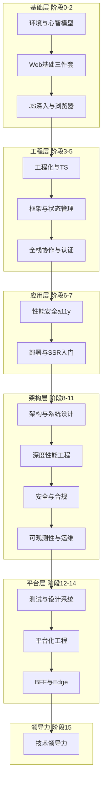

# Web 工程师知识地图

> 面向具备 Android / Flutter / React Native 经验的开发者，系统梳理 Web 开发 **从入门到高级工程师** 所需的完整知识体系。  
> 与 [README](./README.md) 中的学习目标一致：建立全面且深入的知识体系，达到 **高级 Web 开发工程师** 水平，能独立承担架构设计、生产级工程治理与复杂项目交付。

---

## 如何使用本地图

- **按阶段学习**：从阶段 0 开始逐阶段推进；每完成一项可在 `[ ]` 中打勾为 `[x]`。
- **由浅入深**：阶段 0–2 打基础，3–5 建工程与框架能力，6–7 达生产就绪，8–15 进阶架构与平台化。
- **序号规则**：知识点采用 `{阶段}.{小节}.{子节}.{条目}` 编号（无子节时为三级），如 `0.1.1`、`1.1.2.3`；笔记与示例文件名以相同序号开头。
- **对照笔记与示例**：每个知识点链接到 `notes/` 详情笔记与 `examples/` 配套代码（路径序号一致）。
- **移动端对照**：标注 **📱 移动端对照** 的条目，帮助 Android / Flutter / RN 背景开发者快速理解 Web 概念。
- **能力锚点**：阶段 7 达生产就绪；阶段 11 达生产治理；阶段 15 达高级工程师综合标准。

---

## 学习层级与路线总览

| 层级 | 阶段 | 主题 | 核心产出 |
| --- | --- | --- | --- |
| 基础 | 0 | 环境与心智模型 | 搭建开发环境，理解 Web 应用运行方式 |
| 基础 | 1 | HTML / CSS / JS 基础 | 独立实现静态页面与基础交互 |
| 基础 | 2 | JS 深入与浏览器原理 | 理解事件循环、DOM、网络与存储 |
| 工程 | 3 | 工程化与 TypeScript | 使用现代工具链组织中型项目 |
| 工程 | 4 | 框架与状态管理 | 用主流框架开发 SPA 应用 |
| 工程 | 5 | 全栈协作与认证 | 对接 API、处理登录与权限 |
| 应用 | 6 | 性能、安全与可访问性 | 优化体验并规避常见安全风险 |
| 应用 | 7 | 部署运维与 SSR 入门 | 完成构建发布，理解 SSR/SSG |
| 架构 | 8 | 前端架构与系统设计 | 输出 RFC，完成渲染/BFF/模块划分选型 |
| 架构 | 9 | 深度性能工程 | 建立性能预算、RUM 监控与内存/INP 治理 |
| 架构 | 10 | 安全工程与合规 | 制定安全基线，落地 CSP 与供应链治理 |
| 架构 | 11 | 可观测性与生产运维 | 搭建监控、灰度发布与 On-call 流程 |
| 平台 | 12 | 测试策略与设计系统 | 定义测试策略，主导 Design Token 与 Storybook |
| 平台 | 13 | 平台化工程 | 维护 Monorepo、发布流水线与兼容策略 |
| 平台 | 14 | BFF / Node / Edge 运行时 | 设计与实现 BFF、SSR 运行时与 Edge 中间层 |
| 领导 | 15 | 技术领导力与迁移 | 主导遗留迁移、带人与跨团队技术决策 |



---

## 阶段 0：环境与心智模型

### 0.1 Web 应用是什么

> 📖 本章笔记：[notes/00-environment/0.1-what-is-web-app/](./notes/00-environment/0.1-what-is-web-app/README.md)

- [ ] [0.1.1 **客户端—服务器（C/S）模型与请求—响应循环**](./notes/00-environment/0.1-what-is-web-app/0.1.1.client-server-model.md)
- [ ] [0.1.2 **浏览器的角色：HTML/CSS/JS 解析、渲染、执行**](./notes/00-environment/0.1-what-is-web-app/0.1.2.browser-role.md)
- [ ] [0.1.3 **单页应用（SPA）vs 多页应用（MPA）的区别与适用场景**](./notes/00-environment/0.1-what-is-web-app/0.1.3.spa-vs-mpa.md)
- [ ] [0.1.4 **同源策略与跨域问题的来源**](./notes/00-environment/0.1-what-is-web-app/0.1.4.same-origin-policy.md)
- [ ] [0.1.5 📱 移动端对照：浏览器 ≈ WebView / 系统浏览器；SPA ≈ 单 Activity + Fragment 导航](./notes/00-environment/0.1-what-is-web-app/0.1.5.mobile-comparison.md)

### 0.2 开发环境

- [ ] [0.2.1 安装与配置：**Node.js**、**npm / yarn / pnpm**](./notes/00-environment/0.2-dev-environment/0.2.1.node.js.md)
- [ ] [0.2.2 熟练使用 **VS Code / Cursor** 及 Web 相关插件（ESLint、Prettier、Live Server 等）](./notes/00-environment/0.2-dev-environment/0.2.2.vs-code-cursor.md)
- [ ] [0.2.3 熟练使用 **Chrome DevTools**（Elements、Console、Network、Sources、Performance、Application）](./notes/00-environment/0.2-dev-environment/0.2.3.chrome-devtools.md)
- [ ] [0.2.4 了解 **Git** 基础：clone、branch、commit、merge、rebase、PR 工作流](./notes/00-environment/0.2-dev-environment/0.2.4.git.md)
- [ ] [0.2.5 📱 移动端对照：npm ≈ pub / CocoaPods / Gradle 依赖管理；Vite dev server ≈ Hot Reload](./notes/00-environment/0.2-dev-environment/0.2.5.npm-pub-cocoapods-gradle-vite.md)

### 0.3 网络基础（Web 开发者必备）

- [ ] [0.3.1 **URL** 结构：协议、域名、端口、路径、查询参数、锚点](./notes/00-environment/0.3-network-basics/0.3.1.url.md)
- [ ] [0.3.2 **HTTP/HTTPS** 协议：方法（GET/POST/PUT/PATCH/DELETE）、状态码、请求头/响应头](./notes/00-environment/0.3-network-basics/0.3.2.http-https.md)
- [ ] [0.3.3 **HTTP/1.1、HTTP/2、HTTP/3** 基本概念与差异](./notes/00-environment/0.3-network-basics/0.3.3.http-http-http.md)
- [ ] [0.3.4 **Cookie、Session、LocalStorage、SessionStorage** 的区别与使用场景](./notes/00-environment/0.3-network-basics/0.3.4.cookie-session-localstorage-sessionstorage.md)
- [ ] [0.3.5 **DNS** 解析与 **CDN** 基本概念](./notes/00-environment/0.3-network-basics/0.3.5.dns.md)
- [ ] [0.3.6 **TLS/SSL** 与 HTTPS 加密的基本原理](./notes/00-environment/0.3-network-basics/0.3.6.tls-ssl.md)
- [ ] [0.3.7 **RESTful API** 设计风格与常见约定](./notes/00-environment/0.3-network-basics/0.3.7.restful-api.md)
- [ ] [0.3.8 **WebSocket** 与长连接的基本概念](./notes/00-environment/0.3-network-basics/0.3.8.websocket.md)
- [ ] [0.3.9 📱 移动端对照：Retrofit/OkHttp/Dio ≈ fetch/axios；SharedPreferences ≈ localStorage](./notes/00-environment/0.3-network-basics/0.3.9.retrofit-okhttp-dio-fetch-axios.md)

---

## 阶段 1：Web 基础三件套

### 1.1 HTML

#### 1.1.1 文档结构与语义化

- [ ] [1.1.1.1 `<!DOCTYPE html>`、`<html>`、`<head>`、`<body>` 文档结构](./notes/01-web-fundamentals/1.1-html/1.1.1.1.doctype-html.md)
- [ ] [1.1.1.2 语义化标签：`<header>`、`<nav>`、`<main>`、`<section>`、`<article>`、`<aside>`、`<footer>`](./notes/01-web-fundamentals/1.1-html/1.1.1.2.header.md)
- [ ] [1.1.1.3 标题与文本：`<h1>`–`<h6>`、`<p>`、`<span>`、`<strong>`、`<em>`、`<br>`、`<hr>`](./notes/01-web-fundamentals/1.1-html/1.1.1.3.h1.md)
- [ ] [1.1.1.4 列表：`<ul>`、`<ol>`、`<li>`、`<dl>`、`<dt>`、`<dd>`](./notes/01-web-fundamentals/1.1-html/1.1.1.4.ul.md)
- [ ] [1.1.1.5 链接与导航：`<a href>`、锚点、相对路径与绝对路径](./notes/01-web-fundamentals/1.1-html/1.1.1.5.a-href.md)
- [ ] [1.1.1.6 图片与媒体：``、`<picture>`、`<video>`、`<audio>`、`<source>`、`<figure>`、`<figcaption>`](./notes/01-web-fundamentals/1.1-html/1.1.1.6.img.md)
- [ ] [1.1.1.7 表格：`<table>`、`<thead>`、`<tbody>`、`<tr>`、`<th>`、`<td>`、`<caption>`](./notes/01-web-fundamentals/1.1-html/1.1.1.7.table.md)
- [ ] [1.1.1.8 元信息：`<meta>`（charset、viewport、description、OG 标签）、`<title>`、`<link>`、`<script>`](./notes/01-web-fundamentals/1.1-html/1.1.1.8.meta.md)

#### 1.1.2 表单与用户输入

- [ ] [1.1.2.1 表单：`<form>`、`<input>` 各类型（text、password、email、number、checkbox、radio、file、hidden 等）](./notes/01-web-fundamentals/1.1-html/1.1.2.1.form.md)
- [ ] [1.1.2.2 `<textarea>`、`<select>`、`<option>`、`<optgroup>`、`<button>`、`<label>`、`<fieldset>`、`<legend>`](./notes/01-web-fundamentals/1.1-html/1.1.2.2.textarea.md)
- [ ] [1.1.2.3 表单属性：`required`、`disabled`、`readonly`、`placeholder`、`pattern`、`min`/`max`、`autocomplete`](./notes/01-web-fundamentals/1.1-html/1.1.2.3.required.md)
- [ ] [1.1.2.4 表单提交：method、action、enctype（`application/x-www-form-urlencoded`、`multipart/form-data`）](./notes/01-web-fundamentals/1.1-html/1.1.2.4.application-x-www-form-urlencoded.md)
- [ ] [1.1.2.5 原生表单验证与自定义验证提示](./notes/01-web-fundamentals/1.1-html/1.1.2.5.item-1-1-2-5.md)

#### 1.1.3 HTML5 进阶

- [ ] [1.1.3.1 `<canvas>` 2D 绑图基础](./notes/01-web-fundamentals/1.1-html/1.1.3.1.canvas.md)
- [ ] [1.1.3.2 `<svg>` 矢量图形基础](./notes/01-web-fundamentals/1.1-html/1.1.3.2.svg.md)
- [ ] [1.1.3.3 `<template>`、`<slot>`（为 Web Components 打基础）](./notes/01-web-fundamentals/1.1-html/1.1.3.3.template.md)
- [ ] [1.1.3.4 `<details>` / `<summary>`、`<dialog>`、`<progress>`、`<meter>`](./notes/01-web-fundamentals/1.1-html/1.1.3.4.details.md)
- [ ] [1.1.3.5 `data-*` 自定义属性](./notes/01-web-fundamentals/1.1-html/1.1.3.5.data.md)
- [ ] [1.1.3.6 **SEO 基础**：语义化、标题层级、meta description、结构化数据（JSON-LD 概念）](./notes/01-web-fundamentals/1.1-html/1.1.3.6.seo.md)

### 1.2 CSS

#### 1.2.1 基础与选择器

- [ ] [1.2.1.1 CSS 引入方式：内联、`<style>`、外部样式表](./notes/01-web-fundamentals/1.2-css/1.2.1.1.style.md)
- [ ] [1.2.1.2 选择器：元素、类、ID、属性、伪类（`:hover`、`:focus`、`:nth-child` 等）、伪元素（`::before`、`::after`）](./notes/01-web-fundamentals/1.2-css/1.2.1.2.hover.md)
- [ ] [1.2.1.3 选择器优先级与特异性（Specificity）计算](./notes/01-web-fundamentals/1.2-css/1.2.1.3.specificity.md)
- [ ] [1.2.1.4 继承与 `inherit`、`initial`、`unset`、`revert`](./notes/01-web-fundamentals/1.2-css/1.2.1.4.inherit.md)
- [ ] [1.2.1.5 CSS 变量（Custom Properties）：`--name`、`var()`](./notes/01-web-fundamentals/1.2-css/1.2.1.5.name.md)

#### 1.2.2 盒模型与布局

- [ ] [1.2.2.1 **盒模型**：content、padding、border、margin；`box-sizing: content-box` vs `border-box`](./notes/01-web-fundamentals/1.2-css/1.2.2.1.item-1-2-2-1.md)
- [ ] [1.2.2.2 **显示类型**：`display: block | inline | inline-block | none | flex | grid`](./notes/01-web-fundamentals/1.2-css/1.2.2.2.item-1-2-2-2.md)
- [ ] [1.2.2.3 **定位**：`static`、`relative`、`absolute`、`fixed`、`sticky`](./notes/01-web-fundamentals/1.2-css/1.2.2.3.item-1-2-2-3.md)
- [ ] [1.2.2.4 **Flexbox**：主轴/交叉轴、`justify-content`、`align-items`、`flex-grow/shrink/basis`、`gap`](./notes/01-web-fundamentals/1.2-css/1.2.2.4.flexbox.md)
- [ ] [1.2.2.5 **Grid**：`grid-template-columns/rows`、`fr` 单位、`grid-area`、`gap`、隐式网格](./notes/01-web-fundamentals/1.2-css/1.2.2.5.grid.md)
- [ ] [1.2.2.6 **传统布局**：浮动（float）与清除（clear）— 了解即可，现代项目优先 Flex/Grid](./notes/01-web-fundamentals/1.2-css/1.2.2.6.item-1-2-2-6.md)
- [ ] [1.2.2.7 **多列布局**（`column-count` 等）基础了解](./notes/01-web-fundamentals/1.2-css/1.2.2.7.item-1-2-2-7.md)

#### 1.2.3 视觉与排版

- [ ] [1.2.3.1 颜色：命名色、HEX、RGB/RGBA、HSL/HSLA](./notes/01-web-fundamentals/1.2-css/1.2.3.1.hex-rgb-rgba-hsl-hsla.md)
- [ ] [1.2.3.2 字体：`font-family`、`font-size`、`font-weight`、`line-height`、`letter-spacing`](./notes/01-web-fundamentals/1.2-css/1.2.3.2.font-family.md)
- [ ] [1.2.3.3 `@font-face` 与 Web 字体加载](./notes/01-web-fundamentals/1.2-css/1.2.3.3.font-face.md)
- [ ] [1.2.3.4 文本：`text-align`、`text-decoration`、`text-overflow`、`white-space`、`word-break`](./notes/01-web-fundamentals/1.2-css/1.2.3.4.text-align.md)
- [ ] [1.2.3.5 背景：`background-color`、`background-image`、`background-size/position/repeat`](./notes/01-web-fundamentals/1.2-css/1.2.3.5.background-color.md)
- [ ] [1.2.3.6 边框与圆角：`border`、`border-radius`、`box-shadow`](./notes/01-web-fundamentals/1.2-css/1.2.3.6.border.md)
- [ ] [1.2.3.7 溢出：`overflow`、`overflow-x/y`、`text-overflow: ellipsis`](./notes/01-web-fundamentals/1.2-css/1.2.3.7.overflow.md)

#### 1.2.4 响应式与适配

- [ ] [1.2.4.1 **媒体查询**（`@media`）：断点设计、移动优先 vs 桌面优先](./notes/01-web-fundamentals/1.2-css/1.2.4.1.item-1-2-4-1.md)
- [ ] [1.2.4.2 **viewport** 与移动端适配](./notes/01-web-fundamentals/1.2-css/1.2.4.2.viewport.md)
- [ ] [1.2.4.3 相对单位：`rem`、`em`、`vw`、`vh`、`%`、`ch`](./notes/01-web-fundamentals/1.2-css/1.2.4.3.rem.md)
- [ ] [1.2.4.4 图片响应式：`max-width: 100%`、`<picture>`、`srcset`、`sizes`](./notes/01-web-fundamentals/1.2-css/1.2.4.4.max-width-100.md)
- [ ] [1.2.4.5 **容器查询**（Container Queries）基本概念](./notes/01-web-fundamentals/1.2-css/1.2.4.5.item-1-2-4-5.md)
- [ ] [1.2.4.6 📱 移动端对照：CSS Flex/Grid ≈ Flutter Row/Column/Wrap、RN Flexbox；rem ≈ 相对尺寸单位](./notes/01-web-fundamentals/1.2-css/1.2.4.6.css-flex-grid-flutter-row.md)

#### 1.2.5 动画与交互

- [ ] [1.2.5.1 `transition`：属性、时长、缓动函数](./notes/01-web-fundamentals/1.2-css/1.2.5.1.transition.md)
- [ ] [1.2.5.2 `@keyframes` 与 `animation`](./notes/01-web-fundamentals/1.2-css/1.2.5.2.keyframes.md)
- [ ] [1.2.5.3 `transform`：`translate`、`rotate`、`scale`、`skew`](./notes/01-web-fundamentals/1.2-css/1.2.5.3.transform.md)
- [ ] [1.2.5.4 `cursor`、`user-select`、`pointer-events`](./notes/01-web-fundamentals/1.2-css/1.2.5.4.cursor.md)
- [ ] [1.2.5.5 性能注意：优先使用 `transform` 和 `opacity` 做动画（合成层）](./notes/01-web-fundamentals/1.2-css/1.2.5.5.transform.md)

#### 1.2.6 CSS 工程化入门

- [ ] [1.2.6.1 **BEM** 命名规范](./notes/01-web-fundamentals/1.2-css/1.2.6.1.bem.md)
- [ ] [1.2.6.2 CSS Modules 概念](./notes/01-web-fundamentals/1.2-css/1.2.6.2.css-modules.md)
- [ ] [1.2.6.3 预处理器基础（**Sass/SCSS**）：变量、嵌套、混入（`@mixin`）、继承](./notes/01-web-fundamentals/1.2-css/1.2.6.3.sass-scss.md)
- [ ] [1.2.6.4 原子化 CSS 概念（Tailwind CSS 思路）](./notes/01-web-fundamentals/1.2-css/1.2.6.4.css-tailwind-css.md)
- [ ] [1.2.6.5 现代 CSS：`:is()`、`:where()`、`clamp()`、`min()`、`max()`、逻辑属性（`margin-inline` 等）](./notes/01-web-fundamentals/1.2-css/1.2.6.5.is.md)

### 1.3 JavaScript 基础

#### 1.3.1 语言核心

- [ ] [1.3.1.1 变量：`var`、`let`、`const` 与暂时性死区（TDZ）](./notes/01-web-fundamentals/1.3-javascript/1.3.1.1.var.md)
- [ ] [1.3.1.2 数据类型：原始类型（string、number、boolean、null、undefined、symbol、bigint）与引用类型（object）](./notes/01-web-fundamentals/1.3-javascript/1.3.1.2.string-number-boolean-null-undefined.md)
- [ ] [1.3.1.3 类型判断：`typeof`、`instanceof`、`Array.isArray()`、`Object.prototype.toString`](./notes/01-web-fundamentals/1.3-javascript/1.3.1.3.typeof.md)
- [ ] [1.3.1.4 类型转换：隐式转换、显式转换（`Number()`、`String()`、`Boolean()`）](./notes/01-web-fundamentals/1.3-javascript/1.3.1.4.number.md)
- [ ] [1.3.1.5 运算符：算术、比较、逻辑、空值合并（`??`）、可选链（`?.`）](./notes/01-web-fundamentals/1.3-javascript/1.3.1.5.item-1-3-1-5.md)
- [ ] [1.3.1.6 条件：`if/else`、`switch`、`三元表达式`](./notes/01-web-fundamentals/1.3-javascript/1.3.1.6.if-else.md)
- [ ] [1.3.1.7 循环：`for`、`while`、`do...while`、`for...of`、`for...in`](./notes/01-web-fundamentals/1.3-javascript/1.3.1.7.for.md)
- [ ] [1.3.1.8 函数：声明、表达式、箭头函数、`this` 绑定基础](./notes/01-web-fundamentals/1.3-javascript/1.3.1.8.this.md)
- [ ] [1.3.1.9 作用域：全局、函数、块级作用域；作用域链](./notes/01-web-fundamentals/1.3-javascript/1.3.1.9.item-1-3-1-9.md)
- [ ] [1.3.1.10 闭包（Closure）概念与应用场景](./notes/01-web-fundamentals/1.3-javascript/1.3.1.10.closure.md)
- [ ] [1.3.1.11 数组：创建、`map`、`filter`、`reduce`、`find`、`some`、`every`、`forEach`、解构](./notes/01-web-fundamentals/1.3-javascript/1.3.1.11.map.md)
- [ ] [1.3.1.12 对象：字面量、属性访问、展开运算符（`...`）、解构、计算属性名](./notes/01-web-fundamentals/1.3-javascript/1.3.1.12.....md)
- [ ] [1.3.1.13 字符串：模板字面量、常用方法（`slice`、`split`、`includes`、`replace` 等）](./notes/01-web-fundamentals/1.3-javascript/1.3.1.13.slice.md)
- [ ] [1.3.1.14 📱 移动端对照：JS 基础语法与 Dart/Kotlin/Swift 差异；弱类型 vs 强类型](./notes/01-web-fundamentals/1.3-javascript/1.3.1.14.js-dart-kotlin-swift-vs.md)

#### 1.3.2 ES6+ 重要特性

- [ ] [1.3.2.1 类（`class`）：constructor、方法、继承（`extends`）、`super`、静态方法](./notes/01-web-fundamentals/1.3-javascript/1.3.2.1.class.md)
- [ ] [1.3.2.2 模块（ES Modules）：`import` / `export`（default vs named）](./notes/01-web-fundamentals/1.3-javascript/1.3.2.2.import.md)
- [ ] [1.3.2.3 Promise 基础：`then`、`catch`、`finally`](./notes/01-web-fundamentals/1.3-javascript/1.3.2.3.then.md)
- [ ] [1.3.2.4 `async` / `await`](./notes/01-web-fundamentals/1.3-javascript/1.3.2.4.async.md)
- [ ] [1.3.2.5 迭代器与生成器（了解）](./notes/01-web-fundamentals/1.3-javascript/1.3.2.5.item-1-3-2-5.md)
- [ ] [1.3.2.6 `Map`、`Set`、`WeakMap`、`WeakSet`](./notes/01-web-fundamentals/1.3-javascript/1.3.2.6.map.md)
- [ ] [1.3.2.7 可选链、空值合并、逻辑赋值（`&&=`、`||=`）](./notes/01-web-fundamentals/1.3-javascript/1.3.2.7.item-1-3-2-7.md)
- [ ] [1.3.2.8 顶层 `await`（了解）](./notes/01-web-fundamentals/1.3-javascript/1.3.2.8.await.md)

#### 1.3.3 DOM 操作

- [ ] [1.3.3.1 DOM 树概念：Document、Element、Node、Text](./notes/01-web-fundamentals/1.3-javascript/1.3.3.1.dom-document-element-node-text.md)
- [ ] [1.3.3.2 查询：`getElementById`、`querySelector`、`querySelectorAll`](./notes/01-web-fundamentals/1.3-javascript/1.3.3.2.getelementbyid.md)
- [ ] [1.3.3.3 创建与修改：`createElement`、`appendChild`、`insertBefore`、`removeChild`](./notes/01-web-fundamentals/1.3-javascript/1.3.3.3.createelement.md)
- [ ] [1.3.3.4 属性与样式：`setAttribute`、`classList`（add/remove/toggle）、`style`、`dataset`](./notes/01-web-fundamentals/1.3-javascript/1.3.3.4.setattribute.md)
- [ ] [1.3.3.5 内容：`textContent` vs `innerHTML`（及 XSS 风险）](./notes/01-web-fundamentals/1.3-javascript/1.3.3.5.textcontent.md)
- [ ] [1.3.3.6 尺寸与位置：`offsetWidth/Height`、`clientWidth/Height`、`getBoundingClientRect()`](./notes/01-web-fundamentals/1.3-javascript/1.3.3.6.offsetwidth-height.md)
- [ ] [1.3.3.7 📱 移动端对照：DOM 操作 ≈ 直接操作 Widget 树（Flutter/RN 中较少手写，但理解有助于调试）](./notes/01-web-fundamentals/1.3-javascript/1.3.3.7.dom-widget-flutter-rn.md)

#### 1.3.4 事件

- [ ] [1.3.4.1 事件监听：`addEventListener`、`removeEventListener`](./notes/01-web-fundamentals/1.3-javascript/1.3.4.1.addeventlistener.md)
- [ ] [1.3.4.2 事件流：捕获阶段、目标阶段、冒泡阶段](./notes/01-web-fundamentals/1.3-javascript/1.3.4.2.item-1-3-4-2.md)
- [ ] [1.3.4.3 `event.target` vs `event.currentTarget`](./notes/01-web-fundamentals/1.3-javascript/1.3.4.3.event.target.md)
- [ ] [1.3.4.4 阻止默认行为与冒泡：`preventDefault()`、`stopPropagation()`](./notes/01-web-fundamentals/1.3-javascript/1.3.4.4.preventdefault.md)
- [ ] [1.3.4.5 常见事件：`click`、`input`、`change`、`submit`、`keydown/keyup`、`focus/blur`、`scroll`、`resize`](./notes/01-web-fundamentals/1.3-javascript/1.3.4.5.click.md)
- [ ] [1.3.4.6 事件委托（Event Delegation）](./notes/01-web-fundamentals/1.3-javascript/1.3.4.6.event-delegation.md)
- [ ] [1.3.4.7 自定义事件：`CustomEvent`、`dispatchEvent`](./notes/01-web-fundamentals/1.3-javascript/1.3.4.7.customevent.md)

#### 1.3.5 异步与网络

- [ ] [1.3.5.1 回调函数与回调地狱问题](./notes/01-web-fundamentals/1.3-javascript/1.3.5.1.item-1-3-5-1.md)
- [ ] [1.3.5.2 `XMLHttpRequest` 基础（了解即可，现代用 fetch）](./notes/01-web-fundamentals/1.3-javascript/1.3.5.2.xmlhttprequest.md)
- [ ] [1.3.5.3 **Fetch API**：GET/POST 请求、请求头、响应处理、`response.json()`](./notes/01-web-fundamentals/1.3-javascript/1.3.5.3.fetch-api.md)
- [ ] [1.3.5.4 错误处理：`try/catch/finally`、`throw`](./notes/01-web-fundamentals/1.3-javascript/1.3.5.4.try-catch-finally.md)
- [ ] [1.3.5.5 定时器：`setTimeout`、`setInterval`、`requestAnimationFrame`](./notes/01-web-fundamentals/1.3-javascript/1.3.5.5.settimeout.md)
- [ ] [1.3.5.6 JSON：`JSON.parse`、`JSON.stringify`](./notes/01-web-fundamentals/1.3-javascript/1.3.5.6.json.parse.md)

---

## 阶段 2：JavaScript 深入与浏览器原理

### 2.1 JavaScript 进阶

- [ ] [2.1.1 **原型链**：`prototype`、`__proto__`、`Object.create`](./notes/02-javascript-browser/2.1-js-advanced/2.1.1.item-2-1-1.md)
- [ ] [2.1.2 `this` 详解：默认绑定、隐式绑定、显式绑定（`call/apply/bind`）、`new` 绑定、箭头函数](./notes/02-javascript-browser/2.1-js-advanced/2.1.2.this.md)
- [ ] [2.1.3 **执行上下文**与**调用栈**](./notes/02-javascript-browser/2.1-js-advanced/2.1.3.item-2-1-3.md)
- [ ] [2.1.4 **事件循环（Event Loop）**：宏任务、微任务、`Promise` 与 `setTimeout` 执行顺序](./notes/02-javascript-browser/2.1-js-advanced/2.1.4.event-loop.md)
- [ ] [2.1.5 深拷贝 vs 浅拷贝：展开运算符、`structuredClone`、`JSON` 方式的局限](./notes/02-javascript-browser/2.1-js-advanced/2.1.5.structuredclone.md)
- [ ] [2.1.6 防抖（Debounce）与节流（Throttle）](./notes/02-javascript-browser/2.1-js-advanced/2.1.6.debounce-throttle.md)
- [ ] [2.1.7 柯里化、组合函数（了解）](./notes/02-javascript-browser/2.1-js-advanced/2.1.7.item-2-1-7.md)
- [ ] [2.1.8 模块化发展史：IIFE → CommonJS → AMD → ES Modules](./notes/02-javascript-browser/2.1-js-advanced/2.1.8.iife-commonjs-amd-es-modules.md)
- [ ] [2.1.9 严格模式（`'use strict'`）](./notes/02-javascript-browser/2.1-js-advanced/2.1.9.use-strict.md)
- [ ] [2.1.10 内存管理与垃圾回收基本概念；常见内存泄漏场景（闭包、未清理的监听器、定时器）](./notes/02-javascript-browser/2.1-js-advanced/2.1.10.item-2-1-10.md)
- [ ] [2.1.11 📱 移动端对照：Event Loop ≈ Flutter 单线程 + Event Queue / RN JS Bridge 异步模型](./notes/02-javascript-browser/2.1-js-advanced/2.1.11.event-loop-flutter-event-queue.md)

### 2.2 浏览器原理

- [ ] [2.2.1 浏览器多进程架构（主进程、渲染进程、GPU 进程等）概览](./notes/02-javascript-browser/2.2-browser-internals/2.2.1.gpu.md)
- [ ] [2.2.2 **渲染流水线**：HTML 解析 → DOM 树、CSS 解析 → CSSOM → 渲染树 → 布局（Layout/Reflow）→ 绘制（Paint）→ 合成（Composite）](./notes/02-javascript-browser/2.2-browser-internals/2.2.2.item-2-2-2.md)
- [ ] [2.2.3 重排（Reflow）与重绘（Repaint）的触发条件与优化思路](./notes/02-javascript-browser/2.2-browser-internals/2.2.3.reflow-repaint.md)
- [ ] [2.2.4 关键渲染路径（Critical Rendering Path）优化](./notes/02-javascript-browser/2.2-browser-internals/2.2.4.critical-rendering-path.md)
- [ ] [2.2.5 合成层与 `will-change`、GPU 加速](./notes/02-javascript-browser/2.2-browser-internals/2.2.5.will-change.md)
- [ ] [2.2.6 脚本加载：`async`、`defer` 区别](./notes/02-javascript-browser/2.2-browser-internals/2.2.6.async.md)
- [ ] [2.2.7 资源优先级与预加载：`<link rel="preload">`、`prefetch`、`preconnect`](./notes/02-javascript-browser/2.2-browser-internals/2.2.7.link-rel-preload.md)
- [ ] [2.2.8 浏览器缓存：**强缓存**（Cache-Control、Expires）与**协商缓存**（ETag、Last-Modified）](./notes/02-javascript-browser/2.2-browser-internals/2.2.8.item-2-2-8.md)
- [ ] [2.2.9 Service Worker 与 PWA 基本概念](./notes/02-javascript-browser/2.2-browser-internals/2.2.9.service-worker-pwa.md)

### 2.3 浏览器存储

- [ ] [2.3.1 `localStorage` / `sessionStorage` API 与限制](./notes/02-javascript-browser/2.3-browser-storage/2.3.1.localstorage.md)
- [ ] [2.3.2 **Cookie**：属性（`HttpOnly`、`Secure`、`SameSite`、`Domain`、`Path`、`Max-Age`）](./notes/02-javascript-browser/2.3-browser-storage/2.3.2.cookie.md)
- [ ] [2.3.3 **IndexedDB** 基本概念（大型结构化本地存储）](./notes/02-javascript-browser/2.3-browser-storage/2.3.3.indexeddb.md)
- [ ] [2.3.4 存储方案选型对比](./notes/02-javascript-browser/2.3-browser-storage/2.3.4.item-2-3-4.md)

### 2.4 Web API 选学

- [ ] [2.4.1 **Intersection Observer**（懒加载、无限滚动）](./notes/02-javascript-browser/2.4-web-apis/2.4.1.intersection-observer.md)
- [ ] [2.4.2 **Resize Observer**](./notes/02-javascript-browser/2.4-web-apis/2.4.2.resize-observer.md)
- [ ] [2.4.3 **Mutation Observer**](./notes/02-javascript-browser/2.4-web-apis/2.4.3.mutation-observer.md)
- [ ] [2.4.4 **Geolocation API**](./notes/02-javascript-browser/2.4-web-apis/2.4.4.geolocation-api.md)
- [ ] [2.4.5 **Clipboard API**](./notes/02-javascript-browser/2.4-web-apis/2.4.5.clipboard-api.md)
- [ ] [2.4.6 **File API** 与文件读取](./notes/02-javascript-browser/2.4-web-apis/2.4.6.file-api.md)
- [ ] [2.4.7 **History API**（`pushState`、`popstate`）— SPA 路由基础](./notes/02-javascript-browser/2.4-web-apis/2.4.7.history-api.md)
- [ ] [2.4.8 **Web Workers** 基本概念](./notes/02-javascript-browser/2.4-web-apis/2.4.8.web-workers.md)
- [ ] [2.4.9 **Notification API** 基础](./notes/02-javascript-browser/2.4-web-apis/2.4.9.notification-api.md)

---

## 阶段 3：工程化与 TypeScript

### 3.1 包管理与项目结构

- [ ] [3.1.1 `package.json`：dependencies vs devDependencies、`scripts`、`engines`](./notes/03-engineering/3.1-package-management/3.1.1.package.json.md)
- [ ] [3.1.2 **npm / yarn / pnpm** 常用命令：install、run、publish、workspace](./notes/03-engineering/3.1-package-management/3.1.2.npm-yarn-pnpm.md)
- [ ] [3.1.3 **语义化版本**（SemVer）：`^`、`~`、锁定版本](./notes/03-engineering/3.1-package-management/3.1.3.item-3-1-3.md)
- [ ] [3.1.4 `package-lock.json` / `yarn.lock` / `pnpm-lock.yaml` 的作用](./notes/03-engineering/3.1-package-management/3.1.4.package-lock.json.md)
- [ ] [3.1.5 **monorepo** 概念（了解 Lerna、Turborepo、pnpm workspace）](./notes/03-engineering/3.1-package-management/3.1.5.monorepo.md)
- [ ] [3.1.6 常见项目目录结构约定（`src/`、`public/`、`dist/`、`tests/`）](./notes/03-engineering/3.1-package-management/3.1.6.src.md)

### 3.2 构建工具

- [ ] [3.2.1 为什么需要构建工具：模块化、转译、打包、压缩、HMR](./notes/03-engineering/3.2-build-tools/3.2.1.hmr.md)
- [ ] [3.2.2 **Vite**：项目创建、配置、`index.html` 入口、环境变量（`.env`）](./notes/03-engineering/3.2-build-tools/3.2.2.vite.md)
- [ ] [3.2.3 **Webpack** 核心概念（了解）：entry、output、loader、plugin、HMR](./notes/03-engineering/3.2-build-tools/3.2.3.webpack.md)
- [ ] [3.2.4 开发服务器与热更新（HMR）原理](./notes/03-engineering/3.2-build-tools/3.2.4.hmr.md)
- [ ] [3.2.5 生产构建：代码分割（Code Splitting）、Tree Shaking、压缩](./notes/03-engineering/3.2-build-tools/3.2.5.code-splitting-tree-shaking.md)
- [ ] [3.2.6 Source Map 的作用与类型](./notes/03-engineering/3.2-build-tools/3.2.6.source-map.md)
- [ ] [3.2.7 📱 移动端对照：Vite/Webpack ≈ Gradle/Xcode Build + Metro Bundler](./notes/03-engineering/3.2-build-tools/3.2.7.vite-webpack-gradle-xcode-build.md)

### 3.3 TypeScript

- [ ] [3.3.1 为什么使用 TypeScript：类型安全、IDE 支持、可维护性](./notes/03-engineering/3.3-typescript/3.3.1.typescript-ide.md)
- [ ] [3.3.2 基础类型：`string`、`number`、`boolean`、`array`、`tuple`、`enum`、`any`、`unknown`、`void`、`never`](./notes/03-engineering/3.3-typescript/3.3.2.string.md)
- [ ] [3.3.3 接口（`interface`）与类型别名（`type`）](./notes/03-engineering/3.3-typescript/3.3.3.interface.md)
- [ ] [3.3.4 联合类型与交叉类型](./notes/03-engineering/3.3-typescript/3.3.4.item-3-3-4.md)
- [ ] [3.3.5 泛型：函数泛型、约束（`extends`）、常用工具类型（`Partial`、`Pick`、`Omit`、`Record`）](./notes/03-engineering/3.3-typescript/3.3.5.extends.md)
- [ ] [3.3.6 类型断言与类型守卫（`typeof`、`instanceof`、自定义守卫）](./notes/03-engineering/3.3-typescript/3.3.6.typeof.md)
- [ ] [3.3.7 函数类型：参数、返回值、可选参数、默认参数](./notes/03-engineering/3.3-typescript/3.3.7.item-3-3-7.md)
- [ ] [3.3.8 类与访问修饰符：`public`、`private`、`protected`、`readonly`](./notes/03-engineering/3.3-typescript/3.3.8.public.md)
- [ ] [3.3.9 模块与声明文件（`.d.ts`）](./notes/03-engineering/3.3-typescript/3.3.9..d.ts.md)
- [ ] [3.3.10 `tsconfig.json` 核心配置：`strict`、`target`、`module`、`paths`（路径别名）](./notes/03-engineering/3.3-typescript/3.3.10.tsconfig.json.md)
- [ ] [3.3.11 与 React/Vue 结合的 TS 类型（组件 Props、事件类型）— 在阶段 4 深化](./notes/03-engineering/3.3-typescript/3.3.11.react-vue-ts-props.md)
- [ ] [3.3.12 📱 移动端对照：TypeScript ≈ Dart 的类型系统 / Kotlin 空安全](./notes/03-engineering/3.3-typescript/3.3.12.typescript-dart-kotlin.md)

### 3.4 代码质量

- [ ] [3.4.1 **ESLint**：规则配置、`eslint-config`、与编辑器集成](./notes/03-engineering/3.4-code-quality/3.4.1.eslint.md)
- [ ] [3.4.2 **Prettier**：格式化与 ESLint 协作](./notes/03-engineering/3.4-code-quality/3.4.2.prettier.md)
- [ ] [3.4.3 **EditorConfig**](./notes/03-engineering/3.4-code-quality/3.4.3.editorconfig.md)
- [ ] [3.4.4 **Husky** + **lint-staged**：提交前检查](./notes/03-engineering/3.4-code-quality/3.4.4.husky.md)
- [ ] [3.4.5 **Conventional Commits** 提交规范](./notes/03-engineering/3.4-code-quality/3.4.5.conventional-commits.md)
- [ ] [3.4.6 `.gitignore` 与 `.npmignore`](./notes/03-engineering/3.4-code-quality/3.4.6..gitignore.md)

### 3.5 测试基础

- [ ] [3.5.1 测试金字塔：单元测试、集成测试、E2E 测试](./notes/03-engineering/3.5-testing-basics/3.5.1.e2e.md)
- [ ] [3.5.2 **Vitest** / **Jest**：基本断言、`describe`/`it`、mock 函数](./notes/03-engineering/3.5-testing-basics/3.5.2.vitest.md)
- [ ] [3.5.3 **React Testing Library** / **Vue Test Utils** 组件测试入门](./notes/03-engineering/3.5-testing-basics/3.5.3.react-testing-library.md)
- [ ] [3.5.4 **Playwright** / **Cypress** E2E 测试概念](./notes/03-engineering/3.5-testing-basics/3.5.4.playwright.md)
- [ ] [3.5.5 测试覆盖率与合理预期](./notes/03-engineering/3.5-testing-basics/3.5.5.item-3-5-5.md)

---

## 阶段 4：框架与状态管理

> 主流框架建议至少深入一个（**React** 或 **Vue**）。有 React Native 经验者优先深耕 React 生态。

### 4.1 前端框架共通概念

- [ ] [4.1.1 声明式 UI vs 命令式 UI](./notes/04-frameworks/4.1-framework-concepts/4.1.1.ui-vs-ui.md)
- [ ] [4.1.2 组件化：组合、复用、单向数据流](./notes/04-frameworks/4.1-framework-concepts/4.1.2.item-4-1-2.md)
- [ ] [4.1.3 虚拟 DOM / 响应式系统原理（概念级）](./notes/04-frameworks/4.1-framework-concepts/4.1.3.dom.md)
- [ ] [4.1.4 客户端路由 vs 服务端路由](./notes/04-frameworks/4.1-framework-concepts/4.1.4.vs.md)
- [ ] [4.1.5 受控组件 vs 非受控组件](./notes/04-frameworks/4.1-framework-concepts/4.1.5.vs.md)
- [ ] [4.1.6 条件渲染、列表渲染与 `key` 的作用](./notes/04-frameworks/4.1-framework-concepts/4.1.6.key.md)
- [ ] [4.1.7 📱 移动端对照：React ≈ React Native；Vue ≈ 组合 Widget + 响应式状态](./notes/04-frameworks/4.1-framework-concepts/4.1.7.react-react-native-vue-widget.md)

### 4.2 React 生态

#### 4.2.1 React 核心

- [ ] [4.2.1.1 JSX 语法与表达式](./notes/04-frameworks/4.2-react/4.2.1.1.jsx.md)
- [ ] [4.2.1.2 函数组件与类组件（重点函数组件）](./notes/04-frameworks/4.2-react/4.2.1.2.item-4-2-1-2.md)
- [ ] [4.2.1.3 Props 与 children](./notes/04-frameworks/4.2-react/4.2.1.3.props-children.md)
- [ ] [4.2.1.4 State：`useState`、状态不可变性（immutable 更新）](./notes/04-frameworks/4.2-react/4.2.1.4.usestate.md)
- [ ] [4.2.1.5 副作用：`useEffect`、依赖数组、清理函数](./notes/04-frameworks/4.2-react/4.2.1.5.useeffect.md)
- [ ] [4.2.1.6 引用：`useRef`（DOM 引用与可变值）](./notes/04-frameworks/4.2-react/4.2.1.6.useref.md)
- [ ] [4.2.1.7 性能：`useMemo`、`useCallback`、`React.memo`](./notes/04-frameworks/4.2-react/4.2.1.7.usememo.md)
- [ ] [4.2.1.8 Context：`createContext`、`useContext` — 跨层传递](./notes/04-frameworks/4.2-react/4.2.1.8.createcontext.md)
- [ ] [4.2.1.9 Reducer：`useReducer` — 复杂状态逻辑](./notes/04-frameworks/4.2-react/4.2.1.9.usereducer.md)
- [ ] [4.2.1.10 自定义 Hook：逻辑复用](./notes/04-frameworks/4.2-react/4.2.1.10.hook.md)
- [ ] [4.2.1.11 错误边界（Error Boundary）](./notes/04-frameworks/4.2-react/4.2.1.11.error-boundary.md)
- [ ] [4.2.1.12 Fragment、`Portal`、`Suspense` 基础](./notes/04-frameworks/4.2-react/4.2.1.12.portal.md)
- [ ] [4.2.1.13 Strict Mode 与双调用（开发环境）](./notes/04-frameworks/4.2-react/4.2.1.13.strict-mode.md)

#### 4.2.2 React 路由

- [ ] [4.2.2.1 **React Router**：`BrowserRouter`、`Routes`、`Route`、`Link`、`useNavigate`、`useParams`、`useSearchParams`](./notes/04-frameworks/4.2-react/4.2.2.1.react-router.md)
- [ ] [4.2.2.2 嵌套路由与布局路由（Layout Route）](./notes/04-frameworks/4.2-react/4.2.2.2.layout-route.md)
- [ ] [4.2.2.3 路由守卫思路：鉴权重定向](./notes/04-frameworks/4.2-react/4.2.2.3.item-4-2-2-3.md)
- [ ] [4.2.2.4 懒加载路由：`React.lazy` + `Suspense`](./notes/04-frameworks/4.2-react/4.2.2.4.react.lazy.md)

#### 4.2.3 React 状态管理

- [ ] [4.2.3.1 何时需要全局状态管理](./notes/04-frameworks/4.2-react/4.2.3.1.item-4-2-3-1.md)
- [ ] [4.2.3.2 **Zustand** 或 **Jotai**（轻量方案）](./notes/04-frameworks/4.2-react/4.2.3.2.zustand.md)
- [ ] [4.2.3.3 **Redux Toolkit**：slice、`createAsyncThunk`、中间件概念](./notes/04-frameworks/4.2-react/4.2.3.3.redux-toolkit.md)
- [ ] [4.2.3.4 服务端状态：**TanStack Query (React Query)** — 请求缓存、重试、失效、乐观更新](./notes/04-frameworks/4.2-react/4.2.3.4.tanstack-query-react-query.md)
- [ ] [4.2.3.5 表单：**React Hook Form** + **Zod** 校验](./notes/04-frameworks/4.2-react/4.2.3.5.react-hook-form.md)

#### 4.2.4 React 工程实践

- [ ] [4.2.4.1 组件设计：展示组件 vs 容器组件](./notes/04-frameworks/4.2-react/4.2.4.1.vs.md)
- [ ] [4.2.4.2 组件库使用：**Ant Design**、**Material UI**、**shadcn/ui** 等](./notes/04-frameworks/4.2-react/4.2.4.2.ant-design.md)
- [ ] [4.2.4.3 CSS 方案：CSS Modules、Styled Components、Tailwind CSS](./notes/04-frameworks/4.2-react/4.2.4.3.css-css-modules-styled-components.md)
- [ ] [4.2.4.4 **Next.js** 入门：文件路由、API Routes、SSR/SSG 概念（阶段 7 深化）](./notes/04-frameworks/4.2-react/4.2.4.4.next.js.md)

### 4.3 Vue 生态

#### 4.3.1 Vue 3 核心

- [ ] [4.3.1.1 模板语法：`{{ }}`、指令（`v-if`、`v-for`、`v-show`、`v-bind`、`v-on`、`v-model`）](./notes/04-frameworks/4.3-vue/4.3.1.1.v-if-v-for-v-show-v-bind-v-on.md)
- [ ] [4.3.1.2 组合式 API：`setup`、`ref`、`reactive`、`computed`、`watch`、`watchEffect`](./notes/04-frameworks/4.3-vue/4.3.1.2.setup.md)
- [ ] [4.3.1.3 生命周期钩子（`onMounted` 等）](./notes/04-frameworks/4.3-vue/4.3.1.3.onmounted.md)
- [ ] [4.3.1.4 组件：Props、`emit`、插槽（默认、具名、作用域）](./notes/04-frameworks/4.3-vue/4.3.1.4.emit.md)
- [ ] [4.3.1.5 依赖注入：`provide` / `inject`](./notes/04-frameworks/4.3-vue/4.3.1.5.provide.md)
- [ ] [4.3.1.6 模板引用：`ref` 获取 DOM](./notes/04-frameworks/4.3-vue/4.3.1.6.ref.md)
- [ ] [4.3.1.7 动态组件与 `<KeepAlive>`](./notes/04-frameworks/4.3-vue/4.3.1.7.keepalive.md)

#### 4.3.2 Vue 路由与状态

- [ ] [4.3.2.1 **Vue Router**：路由配置、导航守卫、动态路由、路由懒加载](./notes/04-frameworks/4.3-vue/4.3.2.1.vue-router.md)
- [ ] [4.3.2.2 **Pinia**：store 定义、state、getters、actions](./notes/04-frameworks/4.3-vue/4.3.2.2.pinia.md)

#### 4.3.3 Vue 工程实践

- [ ] [4.3.3.1 单文件组件（`.vue`）：`<template>`、`<script setup>`、`<style scoped>`](./notes/04-frameworks/4.3-vue/4.3.3.1..vue.md)
- [ ] [4.3.3.2 组件库：**Element Plus**、**Naive UI**、**Vuetify** 等](./notes/04-frameworks/4.3-vue/4.3.3.2.element-plus.md)
- [ ] [4.3.3.3 **Nuxt** 入门概念（SSR 框架）](./notes/04-frameworks/4.3-vue/4.3.3.3.nuxt.md)

### 4.4 CSS 框架与 UI 体系

- [ ] [4.4.1 **Tailwind CSS**：工具类、配置、响应式前缀、暗色模式](./notes/04-frameworks/4.4-css-ui/4.4.1.tailwind-css.md)
- [ ] [4.4.2 设计系统概念：颜色、间距、字体、组件规范](./notes/04-frameworks/4.4-css-ui/4.4.2.item-4-4-2.md)
- [ ] [4.4.3 图标方案：Icon Font、SVG Icon（如 Lucide、Heroicons）](./notes/04-frameworks/4.4-css-ui/4.4.3.icon-font-svg-icon-lucide.md)
- [ ] [4.4.4 暗色模式实现：`prefers-color-scheme`、CSS 变量切换、class 策略](./notes/04-frameworks/4.4-css-ui/4.4.4.prefers-color-scheme.md)

---

## 阶段 5：全栈协作与认证

### 5.1 HTTP 客户端与 API 对接

- [ ] [5.1.1 **axios** 封装：实例、拦截器、错误统一处理](./notes/05-fullstack-auth/5.1-http-client/5.1.1.axios.md)
- [ ] [5.1.2 请求取消：AbortController](./notes/05-fullstack-auth/5.1-http-client/5.1.2.abortcontroller.md)
- [ ] [5.1.3 上传/下载：FormData、Blob、进度监听](./notes/05-fullstack-auth/5.1-http-client/5.1.3.formdata-blob.md)
- [ ] [5.1.4 API 版本管理与文档阅读（OpenAPI / Swagger）](./notes/05-fullstack-auth/5.1-http-client/5.1.4.api-openapi-swagger.md)
- [ ] [5.1.5 Mock 数据：**MSW (Mock Service Worker)** 或 mock 服务器](./notes/05-fullstack-auth/5.1-http-client/5.1.5.msw-mock-service-worker.md)
- [ ] [5.1.6 环境区分：dev / staging / production 的 baseURL 配置](./notes/05-fullstack-auth/5.1-http-client/5.1.6.dev-staging-production-baseurl.md)

### 5.2 认证与授权

- [ ] [5.2.1 **Session + Cookie** 认证流程](./notes/05-fullstack-auth/5.2-auth/5.2.1.session-cookie.md)
- [ ] [5.2.2 **JWT（JSON Web Token）**：access token、refresh token、存储位置权衡](./notes/05-fullstack-auth/5.2-auth/5.2.2.jwt-json-web-token.md)
- [ ] [5.2.3 前端登录流程：登录 → 存 Token → 请求携带 → 刷新/登出](./notes/05-fullstack-auth/5.2-auth/5.2.3.token.md)
- [ ] [5.2.4 请求头：`Authorization: Bearer <token>`](./notes/05-fullstack-auth/5.2-auth/5.2.4.authorization-bearer-token.md)
- [ ] [5.2.5 **OAuth 2.0** 与第三方登录（微信、GitHub、Google）基本概念](./notes/05-fullstack-auth/5.2-auth/5.2.5.oauth.md)
- [ ] [5.2.6 **SSO** 单点登录概念](./notes/05-fullstack-auth/5.2-auth/5.2.6.sso.md)
- [ ] [5.2.7 前端权限控制：路由级、菜单级、按钮级（RBAC 思路）](./notes/05-fullstack-auth/5.2-auth/5.2.7.rbac.md)
- [ ] [5.2.8 📱 移动端对照：Token 存储 ≈ Keychain/Keystore；Cookie 会话 ≈ 服务端 Session](./notes/05-fullstack-auth/5.2-auth/5.2.8.token-keychain-keystore-cookie-session.md)

### 5.3 跨域与安全传输

- [ ] [5.3.1 同源策略详解](./notes/05-fullstack-auth/5.3-cors/5.3.1.item-5-3-1.md)
- [ ] [5.3.2 **CORS**：简单请求、预检请求（OPTIONS）、服务端响应头配置](./notes/05-fullstack-auth/5.3-cors/5.3.2.cors.md)
- [ ] [5.3.3 开发环境代理：`vite.config` / `webpack-dev-server` proxy](./notes/05-fullstack-auth/5.3-cors/5.3.3.vite.config.md)
- [ ] [5.3.4 JSONP 的历史方案（了解）](./notes/05-fullstack-auth/5.3-cors/5.3.4.jsonp.md)
- [ ] [5.3.5 HTTPS 强制与安全响应头（了解：`Content-Security-Policy`、`X-Frame-Options`）](./notes/05-fullstack-auth/5.3-cors/5.3.5.content-security-policy.md)

### 5.4 数据格式与协议

- [ ] [5.4.1 JSON 设计与前后端字段约定（驼峰 vs 下划线）](./notes/05-fullstack-auth/5.4-data-protocols/5.4.1.json-vs.md)
- [ ] [5.4.2 分页、排序、筛选的 API 参数设计](./notes/05-fullstack-auth/5.4-data-protocols/5.4.2.api.md)
- [ ] [5.4.3 文件上传接口约定](./notes/05-fullstack-auth/5.4-data-protocols/5.4.3.item-5-4-3.md)
- [ ] [5.4.4 错误码与统一响应结构（`{ code, data, message }`）](./notes/05-fullstack-auth/5.4-data-protocols/5.4.4.code-data-message.md)
- [ ] [5.4.5 GraphQL 基本概念（选学）：与 REST 对比](./notes/05-fullstack-auth/5.4-data-protocols/5.4.5.graphql-rest.md)
- [ ] [5.4.6 gRPC / Protobuf 在 Web 中的了解（grpc-web）](./notes/05-fullstack-auth/5.4-data-protocols/5.4.6.grpc-protobuf-web-grpc-web.md)

### 5.5 实时通信

- [ ] [5.5.1 **WebSocket** 客户端 API：连接、发送、心跳、重连](./notes/05-fullstack-auth/5.5-realtime/5.5.1.websocket.md)
- [ ] [5.5.2 **Socket.IO** 或原生 WebSocket 封装](./notes/05-fullstack-auth/5.5-realtime/5.5.2.socket.io.md)
- [ ] [5.5.3 **Server-Sent Events (SSE)** 与 WebSocket 场景对比](./notes/05-fullstack-auth/5.5-realtime/5.5.3.server-sent-events-sse.md)
- [ ] [5.5.4 📱 移动端对照：WebSocket ≈ 长连接推送；SSE ≈ 单向流式更新](./notes/05-fullstack-auth/5.5-realtime/5.5.4.websocket-sse.md)

---

## 阶段 6：性能、安全与可访问性

### 6.1 性能优化

#### 6.1.1 加载性能

- [ ] [6.1.1.1 性能指标：**Core Web Vitals**（LCP、INP、CLS）](./notes/06-performance-security/6.1-performance/6.1.1.1.core-web-vitals.md)
- [ ] [6.1.1.2 网络优化：减少请求、压缩（Gzip/Brotli）、HTTP/2 多路复用](./notes/06-performance-security/6.1-performance/6.1.1.2.gzip-brotli-http.md)
- [ ] [6.1.1.3 资源优化：图片格式（WebP/AVIF）、懒加载、响应式图片](./notes/06-performance-security/6.1-performance/6.1.1.3.webp-avif.md)
- [ ] [6.1.1.4 关键 CSS 内联、非关键 CSS 异步](./notes/06-performance-security/6.1-performance/6.1.1.4.css-css.md)
- [ ] [6.1.1.5 JS 优化：代码分割、动态 import、Tree Shaking、减少 bundle 体积](./notes/06-performance-security/6.1-performance/6.1.1.5.js-import-tree-shaking-bundle.md)
- [ ] [6.1.1.6 第三方脚本延迟加载](./notes/06-performance-security/6.1-performance/6.1.1.6.item-6-1-1-6.md)
- [ ] [6.1.1.7 预连接、预加载、预获取策略](./notes/06-performance-security/6.1-performance/6.1.1.7.item-6-1-1-7.md)
- [ ] [6.1.1.8 CDN 加速静态资源](./notes/06-performance-security/6.1-performance/6.1.1.8.cdn.md)

#### 6.1.2 运行时性能

- [ ] [6.1.2.1 避免不必要的重排重绘](./notes/06-performance-security/6.1-performance/6.1.2.1.item-6-1-2-1.md)
- [ ] [6.1.2.2 虚拟列表（长列表优化）](./notes/06-performance-security/6.1-performance/6.1.2.2.item-6-1-2-2.md)
- [ ] [6.1.2.3 防抖节流在滚动、搜索中的应用](./notes/06-performance-security/6.1-performance/6.1.2.3.item-6-1-2-3.md)
- [ ] [6.1.2.4 Web Worker 处理密集计算](./notes/06-performance-security/6.1-performance/6.1.2.4.web-worker.md)
- [ ] [6.1.2.5 React/Vue 性能优化实践：memo、key、合理拆分组件、避免内联对象](./notes/06-performance-security/6.1-performance/6.1.2.5.react-vue-memo-key.md)
- [ ] [6.1.2.6 使用 Performance API 与 Lighthouse 分析](./notes/06-performance-security/6.1-performance/6.1.2.6.performance-api-lighthouse.md)

#### 6.1.3 缓存策略

- [ ] [6.1.3.1 浏览器缓存层级](./notes/06-performance-security/6.1-performance/6.1.3.1.item-6-1-3-1.md)
- [ ] [6.1.3.2 Service Worker 缓存策略（Cache First、Network First 等）](./notes/06-performance-security/6.1-performance/6.1.3.2.service-worker-cache-first-network.md)
- [ ] [6.1.3.3 应用层缓存：React Query 缓存、HTTP 缓存头设置](./notes/06-performance-security/6.1-performance/6.1.3.3.react-query-http.md)

### 6.2 Web 安全

- [ ] [6.2.1 **XSS（跨站脚本）**：存储型、反射型、DOM 型；防御（转义、CSP、`HttpOnly` Cookie）](./notes/06-performance-security/6.2-web-security/6.2.1.xss.md)
- [ ] [6.2.2 **CSRF（跨站请求伪造）**：Token 验证、SameSite Cookie](./notes/06-performance-security/6.2-web-security/6.2.2.csrf.md)
- [ ] [6.2.3 **点击劫持**：`X-Frame-Options`、`frame-ancestors`](./notes/06-performance-security/6.2-web-security/6.2.3.item-6-2-3.md)
- [ ] [6.2.4 敏感信息泄露：不在前端存密钥、Source Map 生产环境处理](./notes/06-performance-security/6.2-web-security/6.2.4.source-map.md)
- [ ] [6.2.5 依赖安全：`npm audit`、供应链安全基本意识](./notes/06-performance-security/6.2-web-security/6.2.5.npm-audit.md)
- [ ] [6.2.6 CORS 配置错误导致的安全问题](./notes/06-performance-security/6.2-web-security/6.2.6.cors.md)
- [ ] [6.2.7 📱 移动端对照：Web XSS ≈ 恶意脚本注入；RN 中较少但 WebView 场景需注意](./notes/06-performance-security/6.2-web-security/6.2.7.web-xss-rn-webview.md)

### 6.3 可访问性（a11y）

- [ ] [6.3.1 WCAG 基本等级（A / AA）概念](./notes/06-performance-security/6.3-a11y/6.3.1.wcag-a-aa.md)
- [ ] [6.3.2 语义化 HTML 与屏幕阅读器](./notes/06-performance-security/6.3-a11y/6.3.2.html.md)
- [ ] [6.3.3 `alt` 文本、`aria-label`、`aria-hidden`、`role` 属性](./notes/06-performance-security/6.3-a11y/6.3.3.alt.md)
- [ ] [6.3.4 键盘导航：`tabindex`、焦点管理、跳过链接](./notes/06-performance-security/6.3-a11y/6.3.4.tabindex.md)
- [ ] [6.3.5 颜色对比度与不只依赖颜色传达信息](./notes/06-performance-security/6.3-a11y/6.3.5.item-6-3-5.md)
- [ ] [6.3.6 表单：`label` 关联、错误提示与 `aria-describedby`](./notes/06-performance-security/6.3-a11y/6.3.6.label.md)
- [ ] [6.3.7 使用 axe DevTools / Lighthouse a11y 检测](./notes/06-performance-security/6.3-a11y/6.3.7.axe-devtools-lighthouse-a11y.md)

### 6.4 国际化（i18n）

- [ ] [6.4.1 多语言文案管理方案](./notes/06-performance-security/6.4-i18n/6.4.1.item-6-4-1.md)
- [ ] [6.4.2 **i18next** / **vue-i18n** 基本使用](./notes/06-performance-security/6.4-i18n/6.4.2.i18next.md)
- [ ] [6.4.3 日期、数字、货币格式化（`Intl` API）](./notes/06-performance-security/6.4-i18n/6.4.3.intl.md)
- [ ] [6.4.4 RTL（从右到左）布局基本概念](./notes/06-performance-security/6.4-i18n/6.4.4.rtl.md)

### 6.5 SEO（搜索引擎优化）

- [ ] [6.5.1 爬虫工作原理与 SPA 的 SEO 挑战](./notes/06-performance-security/6.5-seo/6.5.1.spa-seo.md)
- [ ] [6.5.2 语义化 HTML、合理标题层级](./notes/06-performance-security/6.5-seo/6.5.2.html.md)
- [ ] [6.5.3 Meta 标签：title、description、canonical](./notes/06-performance-security/6.5-seo/6.5.3.meta-title-description-canonical.md)
- [ ] [6.5.4 Open Graph 与 Twitter Card（社交分享）](./notes/06-performance-security/6.5-seo/6.5.4.open-graph-twitter-card.md)
- [ ] [6.5.5 `sitemap.xml`、`robots.txt`](./notes/06-performance-security/6.5-seo/6.5.5.sitemap.xml.md)
- [ ] [6.5.6 结构化数据（Schema.org / JSON-LD）](./notes/06-performance-security/6.5-seo/6.5.6.schema.org-json-ld.md)
- [ ] [6.5.7 SSR/SSG 对 SEO 的价值（与 Next.js/Nuxt 关联）](./notes/06-performance-security/6.5-seo/6.5.7.ssr-ssg-seo-next.js-nuxt.md)

---

## 阶段 7：部署运维与进阶方向

### 7.1 构建与部署

- [ ] [7.1.1 生产构建产物分析：`dist` 目录、资源哈希](./notes/07-deployment/7.1-build-deploy/7.1.1.dist.md)
- [ ] [7.1.2 静态资源托管：**Vercel**、**Netlify**、**GitHub Pages**、**Cloudflare Pages**](./notes/07-deployment/7.1-build-deploy/7.1.2.vercel.md)
- [ ] [7.1.3 **Nginx** 基础：静态文件服务、`try_files`、反向代理、gzip](./notes/07-deployment/7.1-build-deploy/7.1.3.nginx.md)
- [ ] [7.1.4 环境变量在构建与运行时的注入](./notes/07-deployment/7.1-build-deploy/7.1.4.item-7-1-4.md)
- [ ] [7.1.5 SPA 部署：History 模式下的 fallback 配置](./notes/07-deployment/7.1-build-deploy/7.1.5.spa-history-fallback.md)
- [ ] [7.1.6 Docker 容器化前端应用（了解 Dockerfile 多阶段构建）](./notes/07-deployment/7.1-build-deploy/7.1.6.docker-dockerfile.md)
- [ ] [7.1.7 CI/CD 基础：**GitHub Actions** 自动构建与部署](./notes/07-deployment/7.1-build-deploy/7.1.7.github-actions.md)

### 7.2 服务端渲染与全栈框架

- [ ] [7.2.1 CSR vs SSR vs SSG vs ISR 概念与选型](./notes/07-deployment/7.2-ssr/7.2.1.csr-vs-ssr-vs-ssg.md)
- [ ] [7.2.2 **Next.js**：页面路由/App Router、SSR/SSG、`getServerSideProps` 或 Server Components 概念](./notes/07-deployment/7.2-ssr/7.2.2.next.js.md)
- [ ] [7.2.3 **Nuxt**：服务端渲染与静态生成](./notes/07-deployment/7.2-ssr/7.2.3.nuxt.md)
- [ ] [7.2.4 水合（Hydration）概念](./notes/07-deployment/7.2-ssr/7.2.4.hydration.md)
- [ ] [7.2.5 同构应用注意事项（浏览器 API 兼容）](./notes/07-deployment/7.2-ssr/7.2.5.api.md)

### 7.3 进阶主题（持续学习）

- [ ] [7.3.1 **微前端** 架构概念（Module Federation 等）](./notes/07-deployment/7.3-advanced-preview/7.3.1.item-7-3-1.md)
- [ ] [7.3.2 **Web Components**：Custom Elements、Shadow DOM](./notes/07-deployment/7.3-advanced-preview/7.3.2.web-components.md)
- [ ] [7.3.3 **GraphQL** 客户端（Apollo Client、urql）](./notes/07-deployment/7.3-advanced-preview/7.3.3.graphql.md)
- [ ] [7.3.4 **WebAssembly (WASM)** 应用场景](./notes/07-deployment/7.3-advanced-preview/7.3.4.webassembly-wasm.md)
- [ ] [7.3.5 **Electron** / **Tauri** 桌面应用](./notes/07-deployment/7.3-advanced-preview/7.3.5.electron.md)
- [ ] [7.3.6 **React Native Web** / **Expo Web** — 跨端代码复用](./notes/07-deployment/7.3-advanced-preview/7.3.6.react-native-web.md)
- [ ] [7.3.7 可视化：**D3.js**、**ECharts**、**Chart.js**](./notes/07-deployment/7.3-advanced-preview/7.3.7.d3.js.md)
- [ ] [7.3.8 富文本编辑器：ProseMirror、Slate、TipTap](./notes/07-deployment/7.3-advanced-preview/7.3.8.prosemirror-slate-tiptap.md)
- [ ] [7.3.9 低代码/无代码平台原理了解](./notes/07-deployment/7.3-advanced-preview/7.3.9.item-7-3-9.md)

### 7.4 软技能与工程实践

- [ ] [7.4.1 阅读官方文档与 RFC 的能力](./notes/07-deployment/7.4-soft-skills/7.4.1.rfc.md)
- [ ] [7.4.2 需求分析与技术方案简述](./notes/07-deployment/7.4-soft-skills/7.4.2.item-7-4-2.md)
- [ ] [7.4.3 Code Review 要点：可读性、边界情况、性能、安全](./notes/07-deployment/7.4-soft-skills/7.4.3.code-review.md)
- [ ] [7.4.4 技术债务识别与渐进式重构](./notes/07-deployment/7.4-soft-skills/7.4.4.item-7-4-4.md)
- [ ] [7.4.5 与后端、设计、产品的协作流程](./notes/07-deployment/7.4-soft-skills/7.4.5.item-7-4-5.md)
- [ ] [7.4.6 撰写 README、CHANGELOG、API 对接文档](./notes/07-deployment/7.4-soft-skills/7.4.6.readme-changelog-api.md)

---

---

## 阶段 8：前端架构与系统设计

### 8.1 架构思维与文档

- [ ] [8.1.1 **技术 RFC / ADR** 撰写：背景、目标、备选方案、权衡矩阵、决策与后果](./notes/08-architecture/8.1-architecture-docs/8.1.1.rfc-adr.md)
- [ ] [8.1.2 **非功能需求（NFR）** 分析：性能、可用性、安全、可维护性、可扩展性](./notes/08-architecture/8.1-architecture-docs/8.1.2.nfr.md)
- [ ] [8.1.3 **架构图** 绘制：C4 模型（Context / Container / Component）基础](./notes/08-architecture/8.1-architecture-docs/8.1.3.item-8-1-3.md)
- [ ] [8.1.4 **边界划分**：按业务域（Domain）vs 按技术层（Layer）的利弊](./notes/08-architecture/8.1-architecture-docs/8.1.4.item-8-1-4.md)
- [ ] [8.1.5 **依赖规则**：单向依赖、禁止循环依赖、eslint-plugin-boundaries 等 enforcement](./notes/08-architecture/8.1-architecture-docs/8.1.5.item-8-1-5.md)
- [ ] [8.1.6 📱 移动端对照：Android 模块化 / Flutter Feature Module ≈ 前端 Feature-Sliced 划分](./notes/08-architecture/8.1-architecture-docs/8.1.6.android-flutter-feature-module-feature-sliced.md)

### 8.2 应用架构模式

- [ ] [8.2.1 **Feature-Sliced Design (FSD)**：app / pages / widgets / features / entities / shared](./notes/08-architecture/8.2-app-architecture/8.2.1.feature-sliced-design-fsd.md)
- [ ] [8.2.2 **分层架构**：Presentation → Application → Domain → Infrastructure](./notes/08-architecture/8.2-app-architecture/8.2.2.item-8-2-2.md)
- [ ] [8.2.3 **Container / Presentation** 组件分离在大型项目中的演进](./notes/08-architecture/8.2-app-architecture/8.2.3.container-presentation.md)
- [ ] [8.2.4 **模块化路由**：按路由拆包 vs 按功能域拆包的权衡](./notes/08-architecture/8.2-app-architecture/8.2.4.item-8-2-4.md)
- [ ] [8.2.5 **配置驱动 UI**：JSON Schema 表单、低代码渲染引擎思路](./notes/08-architecture/8.2-app-architecture/8.2.5.ui.md)
- [ ] [8.2.6 **插件化架构**：扩展点、注册表、Sandbox 隔离](./notes/08-architecture/8.2-app-architecture/8.2.6.item-8-2-6.md)

### 8.3 渲染架构选型

- [ ] [8.3.1 **CSR / SSR / SSG / ISR / Streaming SSR** 深度对比：TTFB、FCP、SEO、成本、复杂度](./notes/08-architecture/8.3-rendering/8.3.1.csr-ssr-ssg-isr-streaming.md)
- [ ] [8.3.2 **React Server Components (RSC)** 与 Server Actions 概念与边界](./notes/08-architecture/8.3-rendering/8.3.2.react-server-components-rsc.md)
- [ ] [8.3.3 **Partial Hydration / Selective Hydration** 与 Islands 架构（Astro 思路）](./notes/08-architecture/8.3-rendering/8.3.3.partial-hydration-selective-hydration.md)
- [ ] [8.3.4 **水合（Hydration）** 不匹配：成因、检测、修复策略](./notes/08-architecture/8.3-rendering/8.3.4.hydration.md)
- [ ] [8.3.5 **同构代码** 规范：浏览器 API 守卫、环境分支、动态 import](./notes/08-architecture/8.3-rendering/8.3.5.item-8-3-5.md)
- [ ] [8.3.6 **Edge SSR** vs **Origin SSR**：延迟、缓存、数据一致性](./notes/08-architecture/8.3-rendering/8.3.6.edge-ssr.md)
- [ ] [8.3.7 输出 **渲染架构决策树**，能向团队解释选型理由](./notes/08-architecture/8.3-rendering/8.3.7.item-8-3-7.md)

### 8.4 微前端与大型应用

- [ ] [8.4.1 **微前端** 动机：独立部署、团队自治、技术栈共存](./notes/08-architecture/8.4-micro-frontends/8.4.1.item-8-4-1.md)
- [ ] [8.4.2 **集成方式**：构建时（Module Federation）vs 运行时（single-spa、iframe、Web Components）](./notes/08-architecture/8.4-micro-frontends/8.4.2.item-8-4-2.md)
- [ ] [8.4.3 **Module Federation** 深入：shared 依赖、singleton、版本对齐、远程入口](./notes/08-architecture/8.4-micro-frontends/8.4.3.module-federation.md)
- [ ] [8.4.4 **样式隔离**：Shadow DOM、CSS Modules、CSS-in-JS 冲突、全局污染](./notes/08-architecture/8.4-micro-frontends/8.4.4.item-8-4-4.md)
- [ ] [8.4.5 **路由协调**：基座路由、子应用激活、404 与 deep link](./notes/08-architecture/8.4-micro-frontends/8.4.5.item-8-4-5.md)
- [ ] [8.4.6 **跨应用通信**：CustomEvent、Broadcast Channel、全局 Store 反模式](./notes/08-architecture/8.4-micro-frontends/8.4.6.item-8-4-6.md)
- [ ] [8.4.7 **微前端** 的反模式与何时 **不应** 采用微前端](./notes/08-architecture/8.4-micro-frontends/8.4.7.item-8-4-7.md)

### 8.5 BFF 与 API 层架构

- [ ] [8.5.1 **BFF（Backend for Frontend）** 模式：聚合、裁剪、鉴权下沉](./notes/08-architecture/8.5-bff/8.5.1.bff-backend-for-frontend.md)
- [ ] [8.5.2 BFF vs 直连后端 API：何时引入 BFF](./notes/08-architecture/8.5-bff/8.5.2.bff-vs-api-bff.md)
- [ ] [8.5.3 **GraphQL BFF** vs **REST BFF** 场景对比](./notes/08-architecture/8.5-bff/8.5.3.graphql-bff.md)
- [ ] [8.5.4 **API 版本化** 与前端兼容策略：并行版本、Deprecation Header](./notes/08-architecture/8.5-bff/8.5.4.api.md)
- [ ] [8.5.5 **DTO 映射**：驼峰/下划线、日期时区、空值语义统一](./notes/08-architecture/8.5-bff/8.5.5.dto.md)
- [ ] [8.5.6 📱 移动端对照：BFF ≈ 移动端专用 Gateway / API Adapter 层](./notes/08-architecture/8.5-bff/8.5.6.bff-gateway-api-adapter.md)

### 8.6 状态与数据架构

- [ ] [8.6.1 **客户端状态 vs 服务端状态** 边界：何时用 Zustand vs TanStack Query](./notes/08-architecture/8.6-state-data/8.6.1.vs.md)
- [ ] [8.6.2 **Query Key 规范** 与缓存层级设计（全局命名空间）](./notes/08-architecture/8.6-state-data/8.6.2.query-key.md)
- [ ] [8.6.3 **Optimistic Update** 冲突检测与回滚策略](./notes/08-architecture/8.6-state-data/8.6.3.optimistic-update.md)
- [ ] [8.6.4 **Stale-While-Revalidate** 在产品中的用户体验权衡](./notes/08-architecture/8.6-state-data/8.6.4.stale-while-revalidate.md)
- [ ] [8.6.5 **Offline-first** 架构：IndexedDB、Background Sync、冲突解决思路](./notes/08-architecture/8.6-state-data/8.6.5.offline-first.md)
- [ ] [8.6.6 **Local-first** 与 CRDT（Yjs、Automerge）基本概念 — 协作场景选学](./notes/08-architecture/8.6-state-data/8.6.6.local-first.md)
- [ ] [8.6.7 **Event Sourcing / CQRS** 在前端的了解（复杂 B 端）](./notes/08-architecture/8.6-state-data/8.6.7.event-sourcing-cqrs.md)

### 8.7 能力锚点（阶段 8）

- 能对中等复杂度产品输出 **架构 RFC**，含至少 2 种备选方案与明确决策
- 能解释团队项目为何采用当前渲染模式，并列出已知 trade-off

---

## 阶段 9：深度性能工程

### 9.1 性能度量体系

- [ ] [9.1.1 **Lab vs RUM**：Lighthouse / WebPageTest vs 真实用户数据](./notes/09-performance/9.1-performance-metrics/9.1.1.lab-vs-rum.md)
- [ ] [9.1.2 **Core Web Vitals** 深度：LCP 元素归因、INP 交互归因、CLS 布局偏移源](./notes/09-performance/9.1-performance-metrics/9.1.2.core-web-vitals.md)
- [ ] [9.1.3 **web-vitals** 库采集与上报架构](./notes/09-performance/9.1-performance-metrics/9.1.3.web-vitals.md)
- [ ] [9.1.4 **Performance API**：Navigation Timing、Resource Timing、Long Task API](./notes/09-performance/9.1-performance-metrics/9.1.4.performance-api.md)
- [ ] [9.1.5 **自定义性能标记**：`performance.mark` / `measure`、React Profiler](./notes/09-performance/9.1-performance-metrics/9.1.5.item-9-1-5.md)
- [ ] [9.1.6 **性能回归** 检测：CI 中 Lighthouse CI、bundle 体积门禁](./notes/09-performance/9.1-performance-metrics/9.1.6.item-9-1-6.md)
- [ ] [9.1.7 📱 移动端对照：Web RUM ≈ Firebase Performance / 自建 APM 客户端上报](./notes/09-performance/9.1-performance-metrics/9.1.7.web-rum-firebase-performance-apm.md)

### 9.2 性能预算与治理

- [ ] [9.2.1 **Performance Budget** 定义：JS/CSS 体积、请求数、LCP/INP 阈值](./notes/09-performance/9.2-performance-budget/9.2.1.performance-budget.md)
- [ ] [9.2.2 **Bundle 分析**：rollup-plugin-visualizer、webpack-bundle-analyzer、`source-map-explorer`](./notes/09-performance/9.2-performance-budget/9.2.2.bundle.md)
- [ ] [9.2.3 **CI 门禁**：bundlesize、size-limit、PR 评论机器人](./notes/09-performance/9.2-performance-budget/9.2.3.ci.md)
- [ ] [9.2.4 **第三方脚本审计** 流程：分类、延迟加载、移除冗余](./notes/09-performance/9.2-performance-budget/9.2.4.item-9-2-4.md)
- [ ] [9.2.5 **Partytown** 将第三方脚本移至 Web Worker 的思路](./notes/09-performance/9.2-performance-budget/9.2.5.partytown.md)

### 9.3 加载性能进阶

- [ ] [9.3.1 **Critical CSS** 提取与内联策略](./notes/09-performance/9.3-loading-advanced/9.3.1.critical-css.md)
- [ ] [9.3.2 **字体优化**：`font-display`、subset、preload、FOIT/FOUT 治理](./notes/09-performance/9.3-loading-advanced/9.3.2.item-9-3-2.md)
- [ ] [9.3.3 **图片管线**：CDN 变换、blur placeholder、LQIP、AVIF/WebP 回退链](./notes/09-performance/9.3-loading-advanced/9.3.3.item-9-3-3.md)
- [ ] [9.3.4 **Speculation Rules API**、`<link rel="prefetch/prerender">` 产品化](./notes/09-performance/9.3-loading-advanced/9.3.4.speculation-rules-api.md)
- [ ] [9.3.5 **HTTP/3**、Early Hints (103)、103 vs Server Push 历史](./notes/09-performance/9.3-loading-advanced/9.3.5.http.md)
- [ ] [9.3.6 **Edge 缓存** 与 **CDN 缓存键** 设计（Query String、Cookie Vary）](./notes/09-performance/9.3-loading-advanced/9.3.6.edge.md)

### 9.4 运行时性能进阶

- [ ] [9.4.1 **Long Task** 分析与拆分：`scheduler.postTask`、React Concurrent Features](./notes/09-performance/9.4-runtime-advanced/9.4.1.long-task.md)
- [ ] [9.4.2 **INP 优化**：输入延迟、事件处理器优化、debounce 策略升级](./notes/09-performance/9.4-runtime-advanced/9.4.2.inp.md)
- [ ] [9.4.3 **内存 profiling**：Heap Snapshot、Detached DOM、SPA 路由切换泄漏](./notes/09-performance/9.4-runtime-advanced/9.4.3.profiling.md)
- [ ] [9.4.4 **WeakRef / FinalizationRegistry** 在缓存场景的应用](./notes/09-performance/9.4-runtime-advanced/9.4.4.weakref-finalizationregistry.md)
- [ ] [9.4.5 **虚拟列表进阶**：可变高度、滚动回收池、`content-visibility`](./notes/09-performance/9.4-runtime-advanced/9.4.5.item-9-4-5.md)
- [ ] [9.4.6 **Web Worker** 生产级：任务队列、 transferable objects、Worker 池](./notes/09-performance/9.4-runtime-advanced/9.4.6.web-worker.md)
- [ ] [9.4.7 **requestIdleCallback** 与低优先级任务调度](./notes/09-performance/9.4-runtime-advanced/9.4.7.requestidlecallback.md)

### 9.5 SSR / 流式渲染性能

- [ ] [9.5.1 **Streaming HTML**：`renderToReadableStream`、Suspense 边界](./notes/09-performance/9.5-ssr-streaming/9.5.1.streaming-html.md)
- [ ] [9.5.2 **选择性水合** 与组件优先级](./notes/09-performance/9.5-ssr-streaming/9.5.2.item-9-5-2.md)
- [ ] [9.5.3 **TTFB vs FCP** 在 SSR 场景的权衡](./notes/09-performance/9.5-ssr-streaming/9.5.3.ttfb-vs-fcp.md)
- [ ] [9.5.4 **数据预取与水合**：TanStack Query `dehydrate/hydrate`](./notes/09-performance/9.5-ssr-streaming/9.5.4.item-9-5-4.md)
- [ ] [9.5.5 **Edge 渲染** 的数据访问限制与缓存策略](./notes/09-performance/9.5-ssr-streaming/9.5.5.edge.md)

### 9.6 能力锚点（阶段 9）

- 能为项目建立 **性能预算** 并接入 CI
- 能用 DevTools Memory / Performance 定位一次生产级性能或内存问题

---

## 阶段 10：安全工程与合规

### 10.1 前端安全基线

- [ ] [10.1.1 制定团队 **前端安全 Checklist**（发布前 / Code Review）](./notes/10-security/10.1-security-baseline/10.1.1.checklist.md)
- [ ] [10.1.2 **OWASP Top 10** 与 Web 前端相关项系统性梳理](./notes/10-security/10.1-security-baseline/10.1.2.owasp-top.md)
- [ ] [10.1.3 **威胁建模** 基础：STRIDE、数据流图、信任边界](./notes/10-security/10.1-security-baseline/10.1.3.item-10-1-3.md)
- [ ] [10.1.4 **Security Review** 在 PR 流程中的嵌入](./notes/10-security/10.1-security-baseline/10.1.4.security-review.md)

### 10.2 漏洞深度与防御

- [ ] [10.2.1 **XSS** 进阶：mXSS、DOM Clobbering、模板注入、`DOMPurify` 配置](./notes/10-security/10.2-vulnerabilities/10.2.1.xss.md)
- [ ] [10.2.2 **CSP** 生产级：`nonce`、`strict-dynamic`、`report-to`、`Content-Security-Policy-Report-Only`](./notes/10-security/10.2-vulnerabilities/10.2.2.csp.md)
- [ ] [10.2.3 **CSRF** 进阶：Double Submit Cookie、SameSite 策略选型](./notes/10-security/10.2-vulnerabilities/10.2.3.csrf.md)
- [ ] [10.2.4 **Clickjacking**：`X-Frame-Options`、`frame-ancestors`、UI Redressing](./notes/10-security/10.2-vulnerabilities/10.2.4.clickjacking.md)
- [ ] [10.2.5 **Open Redirect** 检测与 allowlist](./notes/10-security/10.2-vulnerabilities/10.2.5.open-redirect.md)
- [ ] [10.2.6 **Prototype Pollution** 与供应链中的传递](./notes/10-security/10.2-vulnerabilities/10.2.6.prototype-pollution.md)
- [ ] [10.2.7 **SRI（Subresource Integrity）** 与 CDN 资源完整性](./notes/10-security/10.2-vulnerabilities/10.2.7.sri-subresource-integrity.md)
- [ ] [10.2.8 **PostMessage** 跨窗口通信安全：`origin` 校验](./notes/10-security/10.2-vulnerabilities/10.2.8.postmessage.md)

### 10.3 认证与授权进阶

- [ ] [10.3.1 **OAuth 2.0 / OIDC** 深入：Authorization Code + **PKCE** 流程](./notes/10-security/10.3-auth-advanced/10.3.1.oauth-oidc.md)
- [ ] [10.3.2 **Refresh Token** 轮换、Reuse Detection](./notes/10-security/10.3-auth-advanced/10.3.2.refresh-token.md)
- [ ] [10.3.3 **Token 存储** 权衡：HttpOnly Cookie + BFF vs Memory-only vs Secure Storage](./notes/10-security/10.3-auth-advanced/10.3.3.token.md)
- [ ] [10.3.4 **WebAuthn / Passkey** 基本概念](./notes/10-security/10.3-auth-advanced/10.3.4.webauthn-passkey.md)
- [ ] [10.3.5 **RBAC / ABAC** 在前端的表达能力与 **权限数据** 来源](./notes/10-security/10.3-auth-advanced/10.3.5.rbac-abac.md)
- [ ] [10.3.6 **JWT** 陷阱：算法混淆、payload 信任、过期与吊销](./notes/10-security/10.3-auth-advanced/10.3.6.jwt.md)
- [ ] [10.3.7 📱 移动端对照：Web HttpOnly Cookie 会话 ≈ 服务端 Session；RN Keychain ≈ 无 XSS 的本地 Token 存储](./notes/10-security/10.3-auth-advanced/10.3.7.web-httponly-cookie-session-rn.md)

### 10.4 供应链与 Secrets

- [ ] [10.4.1 **npm 供应链安全**：lockfile 完整性、最小权限 Token、私有 registry](./notes/10-security/10.4-supply-chain/10.4.1.npm.md)
- [ ] [10.4.2 **Dependabot / Renovate** 策略与 emergency patch 流程](./notes/10-security/10.4-supply-chain/10.4.2.dependabot-renovate.md)
- [ ] [10.4.3 **SBOM** 概念与 `npm audit`、Socket、Snyk 等工具](./notes/10-security/10.4-supply-chain/10.4.3.sbom.md)
- [ ] [10.4.4 **Secrets 绝不进前端**：环境变量分层、构建时注入 vs 运行时注入](./notes/10-security/10.4-supply-chain/10.4.4.secrets.md)
- [ ] [10.4.5 **Source Map** 生产策略：仅上传监控平台、禁止公开访问](./notes/10-security/10.4-supply-chain/10.4.5.source-map.md)

### 10.5 隐私与合规

- [ ] [10.5.1 **GDPR / 个人信息保护** 对前端的要求：最小采集、 consent、删除权](./notes/10-security/10.5-privacy-compliance/10.5.1.gdpr.md)
- [ ] [10.5.2 **Cookie Consent** 与 CMP（Cookie Management Platform）集成](./notes/10-security/10.5-privacy-compliance/10.5.2.cookie-consent.md)
- [ ] [10.5.3 **PII 脱敏** 展示：日志、Session Replay、错误上报](./notes/10-security/10.5-privacy-compliance/10.5.3.pii.md)
- [ ] [10.5.4 **CSP / COOP / COEP / CORP** 安全头全套与跨域隔离](./notes/10-security/10.5-privacy-compliance/10.5.4.csp-coop-coep-corp.md)
- [ ] [10.5.5 **SOC2 / PCI** 对前端工程的常见要求（了解）](./notes/10-security/10.5-privacy-compliance/10.5.5.soc2-pci.md)

### 10.6 能力锚点（阶段 10）

- 能为团队输出 **CSP 与 Cookie 策略** 文档
- 能主持一次前端 **威胁建模** 或安全 Review

---

## 阶段 11：可观测性与生产运维

### 11.1 错误监控

- [ ] [11.1.1 **Sentry / Bugsnag** 集成：Source Map 上传、Release 追踪、环境标签](./notes/11-observability/11.1-error-monitoring/11.1.1.sentry-bugsnag.md)
- [ ] [11.1.2 **错误分级**：P0–P3、用户影响面、自动指派](./notes/11-observability/11.1-error-monitoring/11.1.2.item-11-1-2.md)
- [ ] [11.1.3 **Error Boundary** 策略：页面级 / 模块级 / 全局兜底](./notes/11-observability/11.1-error-monitoring/11.1.3.error-boundary.md)
- [ ] [11.1.4 **错误采样** 与配额控制](./notes/11-observability/11.1-error-monitoring/11.1.4.item-11-1-4.md)
- [ ] [11.1.5 **breadcrumbs** 与用户操作路径还原](./notes/11-observability/11.1-error-monitoring/11.1.5.breadcrumbs.md)

### 11.2 日志与指标

- [ ] [11.2.1 **结构化日志** 规范：level、traceId、userId（脱敏）](./notes/11-observability/11.2-logging-metrics/11.2.1.item-11-2-1.md)
- [ ] [11.2.2 **Distributed Tracing** 基础：OpenTelemetry、W3C traceparent](./notes/11-observability/11.2-logging-metrics/11.2.2.distributed-tracing.md)
- [ ] [11.2.3 **前端 Metrics**：自定义计数、histogram、Web Vitals 看板](./notes/11-observability/11.2-logging-metrics/11.2.3.metrics.md)
- [ ] [11.2.4 **Session Replay**（LogRocket、FullStory）与隐私边界](./notes/11-observability/11.2-logging-metrics/11.2.4.session-replay.md)
- [ ] [11.2.5 **Real User Monitoring (RUM)** 看板设计与告警阈值](./notes/11-observability/11.2-logging-metrics/11.2.5.real-user-monitoring-rum.md)

### 11.3 发布与变更管理

- [ ] [11.3.1 **Feature Flag**：LaunchDarkly、Unleash、自研开关；Kill Switch](./notes/11-observability/11.3-release-management/11.3.1.feature-flag.md)
- [ ] [11.3.2 **灰度发布 / Canary**：按用户百分比、地域、白名单](./notes/11-observability/11.3-release-management/11.3.2.canary.md)
- [ ] [11.3.3 **A/B 实验** 前端集成：分流、指标归因、实验污染防护](./notes/11-observability/11.3-release-management/11.3.3.a-b.md)
- [ ] [11.3.4 **Preview Deployment**：每个 PR 独立预览环境](./notes/11-observability/11.3-release-management/11.3.4.preview-deployment.md)
- [ ] [11.3.5 **回滚策略**：静态资源 hash 回滚、SSR 版本回退、数据库迁移协同](./notes/11-observability/11.3-release-management/11.3.5.item-11-3-5.md)
- [ ] [11.3.6 **Incident Response**：On-call、Runbook、Postmortem 模板](./notes/11-observability/11.3-release-management/11.3.6.incident-response.md)

### 11.4 基础设施协作

- [ ] [11.4.1 **CDN** 配置协作：缓存规则、Purge、Geo 路由](./notes/11-observability/11.4-infra/11.4.1.cdn.md)
- [ ] [11.4.2 **Nginx 进阶**：负载均衡、限流、反向代理缓存、WAF 对接](./notes/11-observability/11.4-infra/11.4.2.nginx.md)
- [ ] [11.4.3 **Docker** 多阶段构建 SSR 应用；健康检查](./notes/11-observability/11.4-infra/11.4.3.docker.md)
- [ ] [11.4.4 **Kubernetes** 基础：Deployment、HPA、Ingress — SSR 场景了解](./notes/11-observability/11.4-infra/11.4.4.kubernetes.md)
- [ ] [11.4.5 **GitHub Actions** 进阶：矩阵构建、缓存、环境 secrets、部署审批](./notes/11-observability/11.4-infra/11.4.5.github-actions.md)

### 11.5 能力锚点（阶段 11）

- 能主导搭建 **Sentry + Web Vitals** 监控闭环
- 能设计并文档化 **灰度 + 回滚** 流程

---

## 阶段 12：测试策略与设计系统

### 12.1 测试策略体系

- [ ] [12.1.1 编写团队 **测试策略文档**：测什么、不测什么、覆盖率预期](./notes/12-testing-design-system/12.1-testing-strategy/12.1.1.item-12-1-1.md)
- [ ] [12.1.2 **测试金字塔** 在 Web 团队的落地比例](./notes/12-testing-design-system/12.1-testing-strategy/12.1.2.item-12-1-2.md)
- [ ] [12.1.3 **Contract Testing**：Pact 等前后端契约测试](./notes/12-testing-design-system/12.1-testing-strategy/12.1.3.contract-testing.md)
- [ ] [12.1.4 **Visual Regression**：Chromatic、Percy、Lost Pixel](./notes/12-testing-design-system/12.1-testing-strategy/12.1.4.visual-regression.md)
- [ ] [12.1.5 **Mutation Testing** 概念（Stryker）— 了解](./notes/12-testing-design-system/12.1-testing-strategy/12.1.5.mutation-testing.md)
- [ ] [12.1.6 **E2E 规模化**：Playwright 并行、Sharding、Test Container](./notes/12-testing-design-system/12.1-testing-strategy/12.1.6.e2e.md)
- [ ] [12.1.7 **Flaky Test** 治理：重试策略、quarantine、根因分析](./notes/12-testing-design-system/12.1-testing-strategy/12.1.7.flaky-test.md)
- [ ] [12.1.8 **SSR / Hydration** 专项测试：双端 HTML 一致性](./notes/12-testing-design-system/12.1-testing-strategy/12.1.8.ssr-hydration.md)

### 12.2 专项测试

- [ ] [12.2.1 **a11y 测试流程**：axe 自动化 + 键盘走查 + 屏幕阅读器验收](./notes/12-testing-design-system/12.2-specialized-testing/12.2.1.a11y.md)
- [ ] [12.2.2 **性能回归测试**：Lighthouse CI、bundle diff](./notes/12-testing-design-system/12.2-specialized-testing/12.2.2.item-12-2-2.md)
- [ ] [12.2.3 **国际化测试**：伪本地化（pseudo-localization）、RTL 快照](./notes/12-testing-design-system/12.2-specialized-testing/12.2.3.item-12-2-3.md)
- [ ] [12.2.4 **跨浏览器测试**：BrowserStack、Playwright 多 browser project](./notes/12-testing-design-system/12.2-specialized-testing/12.2.4.item-12-2-4.md)

### 12.3 设计系统架构

- [ ] [12.3.1 **Design Token** 体系：Color、Spacing、Typography、Radius、Shadow](./notes/12-testing-design-system/12.3-design-system/12.3.1.design-token.md)
- [ ] [12.3.2 **Style Dictionary / Tokens Studio** 工作流：Figma → Code](./notes/12-testing-design-system/12.3-design-system/12.3.2.style-dictionary-tokens-studio.md)
- [ ] [12.3.3 **Storybook** 作为组件文档、交互验收与视觉回归基线](./notes/12-testing-design-system/12.3-design-system/12.3.3.storybook.md)
- [ ] [12.3.4 **组件 API 设计原则**：组合 vs 配置、Compound Components、slot](./notes/12-testing-design-system/12.3-design-system/12.3.4.api.md)
- [ ] [12.3.5 **组件版本化**：SemVer、Breaking Change、Codemod 迁移](./notes/12-testing-design-system/12.3-design-system/12.3.5.item-12-3-5.md)
- [ ] [12.3.6 **主题架构**：CSS 变量、class 策略、多品牌 / 白标](./notes/12-testing-design-system/12.3-design-system/12.3.6.item-12-3-6.md)
- [ ] [12.3.7 **跨框架设计系统**：Web Components 封装 — 选学](./notes/12-testing-design-system/12.3-design-system/12.3.7.item-12-3-7.md)

### 12.4 组件库工程

- [ ] [12.4.1 **Tree-shaking** 友好的导出结构](./notes/12-testing-design-system/12.4-component-library/12.4.1.tree-shaking.md)
- [ ] [12.4.2 **Peer Dependencies** 管理（React 单例）](./notes/12-testing-design-system/12.4-component-library/12.4.2.peer-dependencies.md)
- [ ] [12.4.3 **按需加载** 与 `sideEffects` 声明](./notes/12-testing-design-system/12.4-component-library/12.4.3.item-12-4-3.md)
- [ ] [12.4.4 **Changelog** 自动化（Changesets）](./notes/12-testing-design-system/12.4-component-library/12.4.4.changelog.md)
- [ ] [12.4.5 组件 **无障碍** 验收标准内建到 CI](./notes/12-testing-design-system/12.4-component-library/12.4.5.item-12-4-5.md)

### 12.5 能力锚点（阶段 12）

- 能定义并推行团队 **测试策略 + Storybook 规范**
- 能设计一套 **Design Token** 从 Figma 到代码的流水线

---

## 阶段 13：平台化工程

### 13.1 Monorepo 深入

- [ ] [13.1.1 **Turborepo / Nx** 选型与 task pipeline](./notes/13-platform/13.1-monorepo/13.1.1.turborepo-nx.md)
- [ ] [13.1.2 **依赖图** 分析与 affected 构建](./notes/13-platform/13.1-monorepo/13.1.2.item-13-1-2.md)
- [ ] [13.1.3 **Remote Cache** 配置与 CI 加速](./notes/13-platform/13.1-monorepo/13.1.3.remote-cache.md)
- [ ] [13.1.4 **Workspace 协议**：`workspace:*`、内部包版本](./notes/13-platform/13.1-monorepo/13.1.4.workspace.md)
- [ ] [13.1.5 **边界 enforcement**：模块不可跨层 import](./notes/13-platform/13.1-monorepo/13.1.5.enforcement.md)
- [ ] [13.1.6 📱 移动端对照：Monorepo ≈ Android Gradle 多 Module / Melos（Flutter）](./notes/13-platform/13.1-monorepo/13.1.6.monorepo-android-gradle-module-melos.md)

### 13.2 发布与依赖治理

- [ ] [13.2.1 **Changesets** 或 **semantic-release** 自动化版本](./notes/13-platform/13.2-release-deps/13.2.1.changesets.md)
- [ ] [13.2.2 **内部 npm 包** 发布：Verdaccio / Artifactory / GitHub Packages](./notes/13-platform/13.2-release-deps/13.2.2.npm.md)
- [ ] [13.2.3 **Renovate / Dependabot** 策略：分组、自动合并条件、major 升级 playbook](./notes/13-platform/13.2-release-deps/13.2.3.renovate-dependabot.md)
- [ ] [13.2.4 **Lockfile** 政策与 `npm ci` 在 CI 中的强制](./notes/13-platform/13.2-release-deps/13.2.4.lockfile.md)
- [ ] [13.2.5 **Catalog / Override** 统一传递依赖版本（pnpm catalog）](./notes/13-platform/13.2-release-deps/13.2.5.catalog-override.md)

### 13.3 构建系统进阶

- [ ] [13.3.1 **Module Federation** 生产踩坑与调试](./notes/13-platform/13.3-build-advanced/13.3.1.module-federation.md)
- [ ] [13.3.2 **Custom Webpack / Vite Plugin** 开发基础](./notes/13-platform/13.3-build-advanced/13.3.2.custom-webpack-vite-plugin.md)
- [ ] [13.3.3 **esbuild / SWC** 在工具链中的位置](./notes/13-platform/13.3-build-advanced/13.3.3.esbuild-swc.md)
- [ ] [13.3.4 **Persistent Cache** 与 build 性能 profiling](./notes/13-platform/13.3-build-advanced/13.3.4.persistent-cache.md)
- [ ] [13.3.5 **Library Mode** 打包：ESM / CJS / DTS 输出策略](./notes/13-platform/13.3-build-advanced/13.3.5.library-mode.md)

### 13.4 浏览器兼容与渐进增强

- [ ] [13.4.1 **Browserslist** 策略与 `@vitejs/plugin-legacy`](./notes/13-platform/13.4-browser-compat/13.4.1.browserslist.md)
- [ ] [13.4.2 **Polyfill** 按需：`core-js`、Polyfill.io 争议与替代](./notes/13-platform/13.4-browser-compat/13.4.2.polyfill.md)
- [ ] [13.4.3 **Progressive Enhancement** vs **Graceful Degradation**](./notes/13-platform/13.4-browser-compat/13.4.3.progressive-enhancement.md)
- [ ] [13.4.4 **Support Matrix** 文档与 QA 对齐流程](./notes/13-platform/13.4-browser-compat/13.4.4.support-matrix.md)
- [ ] [13.4.5 **Feature Detection** vs User Agent Sniffing](./notes/13-platform/13.4-browser-compat/13.4.5.feature-detection.md)
- [ ] [13.4.6 **CSS `@supports`** 与 JS capability check](./notes/13-platform/13.4-browser-compat/13.4.6.supports.md)
- [ ] [13.4.7 **Print CSS** 与导出/打印场景 — B 端选学](./notes/13-platform/13.4-browser-compat/13.4.7.print-css.md)

### 13.5 开发者体验（DX）

- [ ] [13.5.1 **eslint-config** 组织级共享与版本发布](./notes/13-platform/13.5-dx/13.5.1.eslint-config.md)
- [ ] [13.5.2 **自定义 ESLint 规则** 强制执行架构约束](./notes/13-platform/13.5-dx/13.5.2.eslint.md)
- [ ] [13.5.3 **Codemod**（jscodeshift）大规模迁移](./notes/13-platform/13.5-dx/13.5.3.codemod.md)
- [ ] [13.5.4 **CLI 脚手架** 内部项目初始化模板](./notes/13-platform/13.5-dx/13.5.4.cli.md)
- [ ] [13.5.5 **VS Code 工作区** 推荐扩展与 Snippets 统一](./notes/13-platform/13.5-dx/13.5.5.vs-code.md)

### 13.6 能力锚点（阶段 13）

- 能维护一个 **Monorepo** 含 apps + packages + 统一 CI
- 能输出 **Support Matrix + Polyfill** 策略文档

---

## 阶段 14：BFF / Node / Edge 运行时

> 高级前端常需主导或深度协作 SSR 运行时与 BFF，本节不要求全栈专家级，但需能 **独立设计与实现中间层**。

### 14.1 Node.js 运行时

- [ ] [14.1.1 **Node Event Loop** 与浏览器差异：phases、microtask、`process.nextTick`](./notes/14-bff-runtime/14.1-node-runtime/14.1.1.node-event-loop.md)
- [ ] [14.1.2 **Stream** 与背压（Backpressure）](./notes/14-bff-runtime/14.1-node-runtime/14.1.2.stream.md)
- [ ] [14.1.3 **Worker Threads** 与 CPU 密集任务](./notes/14-bff-runtime/14.1-node-runtime/14.1.3.worker-threads.md)
- [ ] [14.1.4 **环境变量** 与配置管理：`dotenv`、12-factor](./notes/14-bff-runtime/14.1-node-runtime/14.1.4.item-14-1-4.md)
- [ ] [14.1.5 **进程管理**：PM2、cluster mode 基本概念](./notes/14-bff-runtime/14.1-node-runtime/14.1.5.item-14-1-5.md)

### 14.2 BFF 实现

- [ ] [14.2.1 **Fastify / Hono / Express** 选型与中间件模式](./notes/14-bff-runtime/14.2-bff-impl/14.2.1.fastify-hono-express.md)
- [ ] [14.2.2 **请求聚合**：并行 vs 串行、超时与 Partial Failure](./notes/14-bff-runtime/14.2-bff-impl/14.2.2.item-14-2-2.md)
- [ ] [14.2.3 **鉴权中间件**：Session 校验、JWT 验证、权限注入](./notes/14-bff-runtime/14.2-bff-impl/14.2.3.item-14-2-3.md)
- [ ] [14.2.4 **Rate Limiting** 与 CORS 在 BFF 层统一](./notes/14-bff-runtime/14.2-bff-impl/14.2.4.rate-limiting.md)
- [ ] [14.2.5 **错误映射**：后端错误 → 前端友好结构](./notes/14-bff-runtime/14.2-bff-impl/14.2.5.item-14-2-5.md)
- [ ] [14.2.6 **OpenAPI** 生成与契约同步](./notes/14-bff-runtime/14.2-bff-impl/14.2.6.openapi.md)

### 14.3 SSR 框架运行时

- [ ] [14.3.1 **Next.js App Router** 深入：Server Components、Route Handlers、Middleware](./notes/14-bff-runtime/14.3-ssr-runtime/14.3.1.next.js-app-router.md)
- [ ] [14.3.2 **Nuxt Nitro** 服务器引擎概念](./notes/14-bff-runtime/14.3-ssr-runtime/14.3.2.nuxt-nitro.md)
- [ ] [14.3.3 **数据获取** 在 SSR 中的 waterfall 优化](./notes/14-bff-runtime/14.3-ssr-runtime/14.3.3.item-14-3-3.md)
- [ ] [14.3.4 **Cookie / Header** 在 Server Component 中的访问](./notes/14-bff-runtime/14.3-ssr-runtime/14.3.4.cookie-header.md)
- [ ] [14.3.5 **Streaming** 与 Error Handling 边界](./notes/14-bff-runtime/14.3-ssr-runtime/14.3.5.streaming.md)

### 14.4 Edge Runtime

- [ ] [14.4.1 **Edge vs Node** 限制：无 Node API、冷启动、CPU/内存配额](./notes/14-bff-runtime/14.4-edge-runtime/14.4.1.edge-vs-node.md)
- [ ] [14.4.2 **Vercel Edge Functions / Cloudflare Workers** 使用场景](./notes/14-bff-runtime/14.4-edge-runtime/14.4.2.vercel-edge-functions-cloudflare-workers.md)
- [ ] [14.4.3 **Edge Middleware**：鉴权、Geo 路由、A/B 分流](./notes/14-bff-runtime/14.4-edge-runtime/14.4.3.edge-middleware.md)
- [ ] [14.4.4 **KV / D1 / Edge Config** 等 Edge 存储](./notes/14-bff-runtime/14.4-edge-runtime/14.4.4.kv-d1-edge-config.md)
- [ ] [14.4.5 **Edge 缓存** 与 **Stale-While-Revalidate** 在 CDN 层](./notes/14-bff-runtime/14.4-edge-runtime/14.4.5.edge.md)

### 14.5 数据层协作

- [ ] [14.5.1 **GraphQL** 深入：Schema Stitching、N+1、DataLoader、Persisted Queries](./notes/14-bff-runtime/14.5-data-layer/14.5.1.graphql.md)
- [ ] [14.5.2 **Apollo Client / urql** 缓存策略与 SSR](./notes/14-bff-runtime/14.5-data-layer/14.5.2.apollo-client-urql.md)
- [ ] [14.5.3 **Redis** 在 Session / Rate Limit 中的角色 — 了解](./notes/14-bff-runtime/14.5-data-layer/14.5.3.redis.md)
- [ ] [14.5.4 **数据库基础**：能阅读 Prisma schema、理解 migration 对前端的影响](./notes/14-bff-runtime/14.5-data-layer/14.5.4.item-14-5-4.md)
- [ ] [14.5.5 **WebSocket / SSE** 生产级：心跳、重连指数退避、连接池](./notes/14-bff-runtime/14.5-data-layer/14.5.5.websocket-sse.md)

### 14.6 文件与上传

- [ ] [14.6.1 **分片上传**、断点续传、并发控制](./notes/14-bff-runtime/14.6-file-upload/14.6.1.item-14-6-1.md)
- [ ] [14.6.2 **预签名 URL** 直传 OSS / S3](./notes/14-bff-runtime/14.6-file-upload/14.6.2.url.md)
- [ ] [14.6.3 **上传安全**：MIME 校验、大小限制、病毒扫描对接](./notes/14-bff-runtime/14.6-file-upload/14.6.3.item-14-6-3.md)

### 14.7 能力锚点（阶段 14）

- 能独立实现一个 **BFF 层** 完成鉴权 + 接口聚合
- 能解释 **Edge vs Origin** 渲染对数据一致性的影响

---

## 阶段 15：技术领导力与遗留系统治理

### 15.1 技术决策与协作

- [ ] [15.1.1 **技术选型** 流程：PoC、Spike、评审会、决策记录](./notes/15-leadership/15.1-tech-decisions/15.1.1.item-15-1-1.md)
- [ ] [15.1.2 **Build vs Buy**：自研组件库 vs 采购 SaaS / 开源方案](./notes/15-leadership/15.1-tech-decisions/15.1.2.build-vs-buy.md)
- [ ] [15.1.3 **跨团队 API 契约** 协作：Mock First、OpenAPI、联调节奏](./notes/15-leadership/15.1-tech-decisions/15.1.3.api.md)
- [ ] [15.1.4 与 **设计 / 产品 / 后端 / QA / SRE** 的协作界面定义](./notes/15-leadership/15.1-tech-decisions/15.1.4.qa-sre.md)
- [ ] [15.1.5 **Estimation**：Story 拆分、风险缓冲、Unknown Unknowns](./notes/15-leadership/15.1-tech-decisions/15.1.5.estimation.md)

### 15.2 Code Review 与质量文化

- [ ] [15.2.1 **Review 清单**：正确性、边界、性能、安全、a11y、可测试性](./notes/15-leadership/15.2-code-review/15.2.1.review.md)
- [ ] [15.2.2 **Review 规模** 控制与 LGTM 文化](./notes/15-leadership/15.2-code-review/15.2.2.review.md)
- [ ] [15.2.3 **技术债务** 识别、量化（Hotspot）与偿还计划](./notes/15-leadership/15.2-code-review/15.2.3.item-15-2-3.md)
- [ ] [15.2.4 **Boy Scout Rule** 与渐进式重构](./notes/15-leadership/15.2-code-review/15.2.4.boy-scout-rule.md)

### 15.3 带人与团队建设

- [ ] [15.3.1 **Mentoring**：Junior → Mid 成长路径设计](./notes/15-leadership/15.3-mentoring/15.3.1.mentoring.md)
- [ ] [15.3.2 **Pair Programming / Mob** 在前端场景的运用](./notes/15-leadership/15.3-mentoring/15.3.2.pair-programming-mob.md)
- [ ] [15.3.3 **知识分享** 机制：Tech Talk、内部 Wiki、Onboarding 文档](./notes/15-leadership/15.3-mentoring/15.3.3.item-15-3-3.md)
- [ ] [15.3.4 **面试体系**：前端体系化题库与 Live Coding 设计](./notes/15-leadership/15.3-mentoring/15.3.4.item-15-3-4.md)
- [ ] [15.3.5 **Onboarding Checklist** for 新成员](./notes/15-leadership/15.3-mentoring/15.3.5.onboarding-checklist.md)

### 15.4 遗留系统与迁移

- [ ] [15.4.1 **Strangler Fig** 渐进式替换模式](./notes/15-leadership/15.4-legacy-migration/15.4.1.strangler-fig.md)
- [ ] [15.4.2 **jQuery / 老 MPA → React/Vue** 迁移策略](./notes/15-leadership/15.4-legacy-migration/15.4.2.jquery-mpa-react-vue.md)
- [ ] [15.4.3 **双跑（Parallel Run）** 与 Feature Flag 切流](./notes/15-leadership/15.4-legacy-migration/15.4.3.parallel-run.md)
- [ ] [15.4.4 **CSS 遗留债务** 治理：全局命名空间、!important、层叠上下文](./notes/15-leadership/15.4-legacy-migration/15.4.4.css.md)
- [ ] [15.4.5 **Big Bang vs Incremental** 迁移风险评估](./notes/15-leadership/15.4-legacy-migration/15.4.5.big-bang-vs-incremental.md)
- [ ] [15.4.6 **Codemod + 自动化测试** 保障迁移安全](./notes/15-leadership/15.4-legacy-migration/15.4.6.codemod.md)

### 15.5 国际化与无障碍（生产级）

- [ ] [15.5.1 **i18n 架构**：namespace 懒加载、ICU MessageFormat、复数与性别](./notes/15-leadership/15.5-i18n-a11y-prod/15.5.1.i18n.md)
- [ ] [15.5.2 **RTL** 生产级：逻辑属性、镜像图标、BiDi 混排](./notes/15-leadership/15.5-i18n-a11y-prod/15.5.2.rtl.md)
- [ ] [15.5.3 **时区**：`Intl.DateTimeFormat`、dayjs timezone、服务端 UTC 约定](./notes/15-leadership/15.5-i18n-a11y-prod/15.5.3.item-15-5-3.md)
- [ ] [15.5.4 **WCAG 2.2 AA** 达标流程与 VPAT 报告基础](./notes/15-leadership/15.5-i18n-a11y-prod/15.5.4.wcag-aa.md)
- [ ] [15.5.5 **SPA 路由切换** 焦点管理：`focus-trap`、skip link、live region](./notes/15-leadership/15.5-i18n-a11y-prod/15.5.5.spa.md)
- [ ] [15.5.6 复杂组件 a11y：**Combobox、DatePicker、Modal** WAI-ARIA 模式](./notes/15-leadership/15.5-i18n-a11y-prod/15.5.6.combobox-datepicker-modal.md)

### 15.6 Web 平台进阶（按业务选学）

- [ ] [15.6.1 **View Transitions API** 与 SPA 路由动画](./notes/15-leadership/15.6-web-platform-advanced/15.6.1.view-transitions-api.md)
- [ ] [15.6.2 **Navigation API**](./notes/15-leadership/15.6-web-platform-advanced/15.6.2.navigation-api.md)
- [ ] [15.6.3 **OPFS（Origin Private File System）**](./notes/15-leadership/15.6-web-platform-advanced/15.6.3.opfs-origin-private-file-system.md)
- [ ] [15.6.4 **WebRTC** 基础（音视频场景）](./notes/15-leadership/15.6-web-platform-advanced/15.6.4.webrtc.md)
- [ ] [15.6.5 **WebAuthn / Payment Request API**](./notes/15-leadership/15.6-web-platform-advanced/15.6.5.webauthn-payment-request-api.md)
- [ ] [15.6.6 **Import Maps** 与原生 ESM CDN](./notes/15-leadership/15.6-web-platform-advanced/15.6.6.import-maps.md)
- [ ] [15.6.7 **WebAssembly** 线程、SIMD、与 JS 边界](./notes/15-leadership/15.6-web-platform-advanced/15.6.7.webassembly.md)
- [ ] [15.6.8 **WebGL / Three.js** 3D 场景 — 可视化选学](./notes/15-leadership/15.6-web-platform-advanced/15.6.8.webgl-three.js.md)

### 15.7 能力锚点（阶段 15）

- 能主导一次 **遗留模块迁移** 从方案到上线
- 能进行 **技术分享 / RFC 评审** 并推动团队达成共识

---

---

## 知识点索引（按领域）

便于按需查阅，将全部阶段内容按技术领域重新归类：

| 领域 | 涵盖阶段 | 关键知识点 |
| --- | --- | --- |
| HTML | 1 | 语义化、表单、SEO 基础 |
| CSS | 1、4、12 | 布局、响应式、动画、Tailwind、Design Token |
| JavaScript | 1、2 | 语法、异步、DOM、事件循环、原型链 |
| 浏览器 | 0、2 | 渲染原理、缓存、存储、DevTools |
| 网络 | 0、5、14 | HTTP、REST、WebSocket、CORS、GraphQL |
| TypeScript | 3 | 类型系统、泛型、工程配置 |
| 工程化 | 3、13 | 包管理、Vite/Webpack、Monorepo、发布治理 |
| React | 4、8、14 | Hooks、路由、状态管理、RSC、Next.js |
| Vue | 4 | 组合式 API、Pinia、Vue Router、Nuxt |
| 架构 | 8 | FSD、微前端、BFF、渲染选型、RFC |
| 认证安全 | 5、6、10 | JWT、Session、XSS、CSRF、CSP、合规 |
| 性能 | 6、9 | Core Web Vitals、RUM、性能预算、Streaming SSR |
| 可访问性 | 6、12、15 | WCAG、ARIA、键盘导航、生产级 a11y |
| 测试 | 3、12 | 单元/E2E、契约测试、视觉回归 |
| 可观测性 | 11 | Sentry、Feature Flag、灰度、On-call |
| 设计系统 | 4、12 | 组件库、Storybook、Token 流水线 |
| 部署运维 | 7、11 | 静态托管、Nginx、CI/CD、Docker、K8s |
| BFF / 运行时 | 14 | Node、Edge、SSR 深入 |
| 领导力 | 7、15 | Review、迁移、带人、i18n 生产级 |

---

## 推荐学习顺序与里程碑

### 里程碑 1：能写静态页面（阶段 0–1，约 2–4 周）

- 产出：一个响应式个人介绍页或产品落地页（纯 HTML/CSS）

### 里程碑 2：能写交互式页面（阶段 1–2，约 2–4 周）

- 产出：Todo 应用、天气查询等小项目（原生 JS + Fetch）

### 里程碑 3：能使用现代工具链（阶段 3，约 1–2 周）

- 产出：用 Vite + TypeScript 重构之前的项目

### 里程碑 4：能开发 SPA 应用（阶段 4–5，约 4–8 周）

- 产出：带登录、列表、表单的完整管理后台或电商前台（React 或 Vue）

### 里程碑 5：生产就绪（阶段 6–7，约 2–4 周）

- 产出：对里程碑 4 的项目做性能优化、安全加固、部署上线

### 里程碑 6：能输出架构方案（阶段 8，约 2–4 周）

- 产出：一份完整 **技术 RFC**（含渲染选型 + 模块划分 + 风险）

### 里程碑 7：能治理生产质量（阶段 9–11，约 4–6 周）

- 产出：接入 **Sentry + Web Vitals + 性能预算 CI + CSP 草案 + 灰度流程**

### 里程碑 8：能建设团队平台（阶段 12–13，约 4–6 周）

- 产出：**Storybook + Design Token** 流水线；或 **Monorepo** 模板仓库

### 里程碑 9：高级 Web 工程师综合达标（阶段 14–15，约 4–8 周）

- 产出：实现 **BFF 原型** + 主导一次 **模块迁移** + 完成 **Onboarding 文档**

---

## 与移动端经验的加速路径

若你已有 **React Native** 经验，可优先学习：

1. 阶段 1 的 **HTML/CSS**（RN 中较弱的部分）
2. 阶段 2 的 **浏览器原理与 DOM**（RN 无 DOM）
3. 阶段 5 的 **Cookie/CORS/Session**（RN 跨域场景不同）
4. 阶段 6 的 **SEO、a11y、Core Web Vitals**
5. 阶段 7、11 的 **部署、Nginx 与生产运维**
6. 阶段 8–15 的 **架构、监控、平台化**（RN 工程化差异大）

若你已有 **Flutter** 经验，需重点关注：

1. **JavaScript/TypeScript** 整个生态（与 Dart 差异）
2. **HTML 语义化与 CSS 布局**（无 Widget 系统）
3. **浏览器 DevTools** 调试（替代 Flutter DevTools 的部分能力）
4. **npm 生态与 Web 构建工具链**
5. 阶段 8–15 的 **架构治理与 BFF/Edge** 能力

若你已有 **Android** 经验，需重点关注：

1. **CSS 与响应式布局**（无 XML Layout）
2. **JavaScript 异步模型与前端框架**
3. **浏览器安全模型**（Web 特有风险）
4. **前端工程化**（与 Gradle 不同的工具链）
5. 阶段 13 的 **Monorepo**（≈ Gradle 多 Module）

---

## 配套资源规划（本项目目录建议）

```
WebDev_Compass/
├── README.md
├── KNOWLEDGE_MAP.md          # 本文件：Web 工程师知识地图（阶段 0–15）
├── notes/                    # 笔记：{阶段文件夹}/{小节文件夹}/{序号}.{slug}.md
├── examples/                 # 示例：与 notes 同路径规则，扩展名为 .html/.ts 等
└── projects/                 # 完整工程示例（待补充）
```

### 文件命名规范

| 类型 | 路径示例 |
| --- | --- |
| 笔记 | `notes/00-environment/0.1-what-is-web-app/0.1.1.client-server-model.md` |
| 示例 | `examples/00-environment/0.1-what-is-web-app/0.1.1.request-response-demo.html` |
| 小节索引 | `notes/00-environment/0.1-what-is-web-app/README.md` |

---

## 版本记录

| 版本 | 日期 | 说明 |
| --- | --- | --- |
| 1.0 | 2026-07-09 | 初始版本 |
| 2.0 | 2026-07-13 | 融合至阶段 15，目标调整为高级 Web 工程师 |
| 2.1 | 2026-07-13 | 全量知识点四级序号，笔记/示例路径与序号对齐 |

---

**下一步**：从 [阶段 0](#阶段-0环境与心智模型) 开始，点击知识点链接阅读 `notes/` 笔记并运行 `examples/` 示例。
