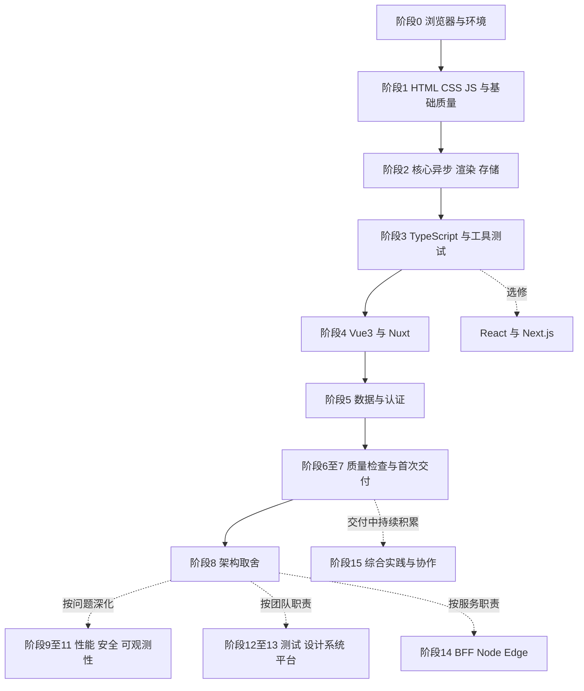

# Web 工程师知识地图

面向已有 Android / Flutter / React Native 经验的开发者。目标是逐步掌握 Web 原理、用户端产品开发与工程治理，默认技术主线为 **HTML/CSS/JavaScript → TypeScript → Vue 3 → Nuxt**。**React / Next.js 是选修**，不阻塞主线交付。

## 如何使用

- 先读[学习主线与阶段验收](./docs/LEARNING_PATH.md)，再在[六个分册](./knowledge-map/README.md)中查知识点。编号是稳定索引，不要求所有条目按数字顺序学完。
- 阶段 0–7 支持完成首个 Vue/Nuxt 产品；其中标为选修、维护选读的主题按需求学习。阶段 8–15 是深入工程专题，按项目问题与职责选择。
- 语义、无障碍、兼容、隐私、安全和测试从基础练习开始执行；后面的专项章负责深化，不是首次出现这些要求。
- 复选框由学习者记录；是否已编写正文与是否通过技术验收分别记录。查询当前覆盖率运行 `python3 scripts/check_knowledge.py --table`。
- 所有知识点使用稳定的三/四级序号。笔记与示例文件名对应序号；缺少正文的项是待建设内容，不能由链接或勾选推导质量。
- 高级能力通过真实项目、独立排障、技术取舍与可复核交付积累，不以读完目录、固定周数或单次示例运行保证职级。

## 路线总览

| 阶段 | 主题 | 定位与核心产出 |
| --- | --- | --- |
| 0 | Web 开发环境、浏览器与 HTTP 基础 | 主线：能观察并解释浏览器请求、资源与错误 |
| 1 | HTML、CSS 与 JavaScript 页面开发 | 主线：语义页面、宽窄布局、原生交互，贯穿兼容与无障碍 |
| 2 | JavaScript 异步、浏览器渲染与存储 | 主线核心先读，其他按需：理解异步、渲染、缓存和存储边界 |
| 3 | TypeScript、Vite、代码检查与测试 | 主线：可复现的工具链、类型、代码检查与最小测试 |
| 4 | Vue 3 + Nuxt 应用开发与状态管理 | 主线：Vue → Nuxt；React/Next 跨生态选修 |
| 5 | HTTP API 对接、登录与权限控制 | 主线：数据校验、失败处理、会话与服务端授权边界 |
| 6 | 页面性能、Web 安全、无障碍与 SEO | 首次交付的质量检查，并按目标深化相关专题 |
| 7 | Nuxt 渲染、构建部署与发布回滚 | 主线闭环：构建、部署、深链刷新、配置、监测与回滚证据 |
| 8 | Vue/Nuxt 模块划分、状态与渲染选型 | 深化：围绕真实需求解释模块、渲染、状态与 BFF 取舍 |
| 9 | Web Vitals 测量、加载与交互性能优化 | 深化：测量和验证性能瓶颈，不机械套用优化技巧 |
| 10 | XSS/CSRF 防护、认证安全与隐私 | 深化：威胁建模、认证、供应链与适用的合规协作 |
| 11 | 错误监控、日志指标与灰度发布 | 深化：错误、指标、发布与事故排查能力 |
| 12 | 自动化测试、Storybook 与 Vue 组件库 | 按职责：复杂测试策略、组件契约与设计系统 |
| 13 | pnpm 多包管理、版本发布与 CI 流水线 | 按团队规模：多包、依赖发布与开发体验治理 |
| 14 | Node.js、Nuxt Nitro 与 BFF 接口开发 | 按服务职责：Nuxt/Nitro 深化；独立 BFF、Edge 按需 |
| 15 | 旧项目迁移、代码评审与团队交付 | 综合交付与协作；特定平台、组织管理按岗位选择 |

```mermaid
flowchart TD
    A[阶段0 浏览器与环境] --> B[阶段1 HTML CSS JS 与基础质量]
    B --> C[阶段2 核心异步 渲染 存储]
    C --> D[阶段3 TypeScript 与工具测试]
    D --> E[阶段4 Vue3 与 Nuxt]
    E --> F[阶段5 数据与认证]
    F --> G[阶段6至7 质量检查与首次交付]
    D -. 选修 .-> R[React 与 Next.js]
    G --> H[阶段8 架构取舍]
    H -. 按问题深化 .-> P[阶段9至11 性能 安全 可观测性]
    H -. 按团队职责 .-> T[阶段12至13 测试 设计系统 平台]
    H -. 按服务职责 .-> N[阶段14 BFF Node Edge]
    G -. 交付中持续积累 .-> I[阶段15 综合实践与协作]
```

阶段编号不是严格时间线：例如 1.4 的质量要求从 1.1 起使用，4.3.3.1 单文件组件先于 Vue API 练习，Nuxt 数据/渲染基础在阶段 4 学习，阶段 7 再做部署专项。关键的安全和配置检查不能因其深入专题编号较大而推迟。

## 分册目录

| 分册 | 涵盖阶段 | 阅读定位 |
| --- | --- | --- |
| [ id="阶段-02基础层"></a>](./knowledge-map/01-foundation-stages-0-2.md) | 0–2 | Web 平台基础、原生练习及基础质量 |
| [ id="阶段-35工程层"></a>](./knowledge-map/02-engineering-stages-3-5.md) | 3–5 | TypeScript、Vue/Nuxt 主线与 API/认证 |
| [ id="阶段-67应用层"></a>](./knowledge-map/03-application-stages-6-7.md) | 6–7 | 质量专项与首个产品交付闭环 |
| [ id="阶段-811架构层"></a>](./knowledge-map/04-architecture-stages-8-11.md) | 8–11 | 架构、性能、安全与可观测性 |
| [ id="阶段-1214平台层"></a>](./knowledge-map/05-platform-stages-12-14.md) | 12–14 | 按职责深入测试、设计系统、平台和 BFF |
| [ id="阶段-15项目整合与附录"></a>](./knowledge-map/06-delivery-stages-15-appendix.md) | 15 | 综合交付、迁移、协作与里程碑 |

## 建设入口

[学习顺序与验收](./docs/LEARNING_PATH.md) · [本次目录审查](./docs/CURRICULUM_REVIEW.md) · [正文建设进度](./docs/PROGRESS.md) · [内容规范](./docs/AUTHORING.md) · [框架专题](./framework-guide/README.md)

阶段 1 已提供 106 项四部分资料，统一入口见 [learning/](./learning/README.md)。阶段2已提供33项、阶段3已提供36项、阶段4已提供59项、阶段5已提供31项四部分资料与综合实践；下一批从 **阶段6：页面性能、Web安全、无障碍与SEO**开始。阶段5先核对规划补齐安全重试/幂等及SSR会话/私有缓存，当前总图587项，React/Next保留选修。独立工程开发继续在 web-common 与各宿主项目中进行。
