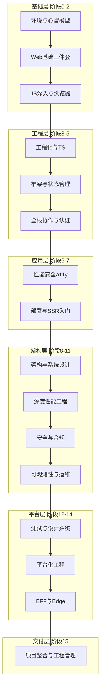

# Web 工程师知识地图

> 面向具备 Android / Flutter / React Native 经验的开发者，系统梳理 Web 开发 **从入门到高级工程师** 所需的完整知识体系。  
> 与 [README](./README.md) 中的学习目标一致：建立全面且深入的知识体系，达到 **高级 Web 开发工程师** 水平，能独立承担架构设计、生产级工程治理与复杂项目交付。

---

## 如何使用本地图

- **按阶段学习**：从阶段 0 开始逐阶段推进；每完成一项可在 `[ ]` 中打勾为 `[x]`。
- **由浅入深**：阶段 0–2 打基础，3–5 建工程与框架能力，6–7 达生产就绪，8–15 进阶架构与平台化。
- **序号规则**：知识点采用 `{阶段}.{小节}.{子节}.{条目}` 编号（无子节时为三级），如 `0.1.1`、`1.1.2.3`；笔记与示例文件名以相同序号开头。
- **对照笔记与示例**：每个知识点链接到 `notes/` 详情笔记与 `examples/` 配套代码（路径序号一致）。
- **移动端对照**：标注 **📱 移动端对照** 的条目，帮助 Android / Flutter / RN 背景开发者快速理解 Web 概念。
- **能力锚点**：阶段 7 达生产就绪；阶段 11 达生产治理；阶段 15 达高级工程师综合标准。

---

## 学习层级与路线总览

| 层级 | 阶段 | 主题 | 核心产出 |
| --- | --- | --- | --- |
| 基础 | 0 | 环境与心智模型 | 搭建开发环境，理解 Web 应用运行方式 |
| 基础 | 1 | HTML / CSS / JS 基础 | 独立实现静态页面与基础交互 |
| 基础 | 2 | JS 深入与浏览器原理 | 理解事件循环、DOM、网络与存储 |
| 工程 | 3 | 工程化与 TypeScript | 使用现代工具链组织中型项目 |
| 工程 | 4 | 框架与状态管理 | 用主流框架开发 SPA 应用 |
| 工程 | 5 | 全栈协作与认证 | 对接 API、处理登录与权限 |
| 应用 | 6 | 性能、安全与可访问性 | 优化体验并规避常见安全风险 |
| 应用 | 7 | 部署运维与 SSR 入门 | 完成构建发布，理解 SSR/SSG |
| 架构 | 8 | 前端架构与系统设计 | 输出 RFC，完成渲染/BFF/模块划分选型 |
| 架构 | 9 | 深度性能工程 | 建立性能预算、RUM 监控与内存/INP 治理 |
| 架构 | 10 | 安全工程与合规 | 制定安全基线，落地 CSP 与供应链治理 |
| 架构 | 11 | 可观测性与生产运维 | 搭建监控、灰度发布与 On-call 流程 |
| 平台 | 12 | 测试策略与设计系统 | 定义测试策略，主导 Design Token 与 Storybook |
| 平台 | 13 | 平台化工程 | 维护 Monorepo、发布流水线与兼容策略 |
| 平台 | 14 | BFF / Node / Edge 运行时 | 设计与实现 BFF、SSR 运行时与 Edge 中间层 |
| 交付 | 15 | 项目整合与工程管理 | 主导遗留迁移、跨团队整合与项目治理 |

---
